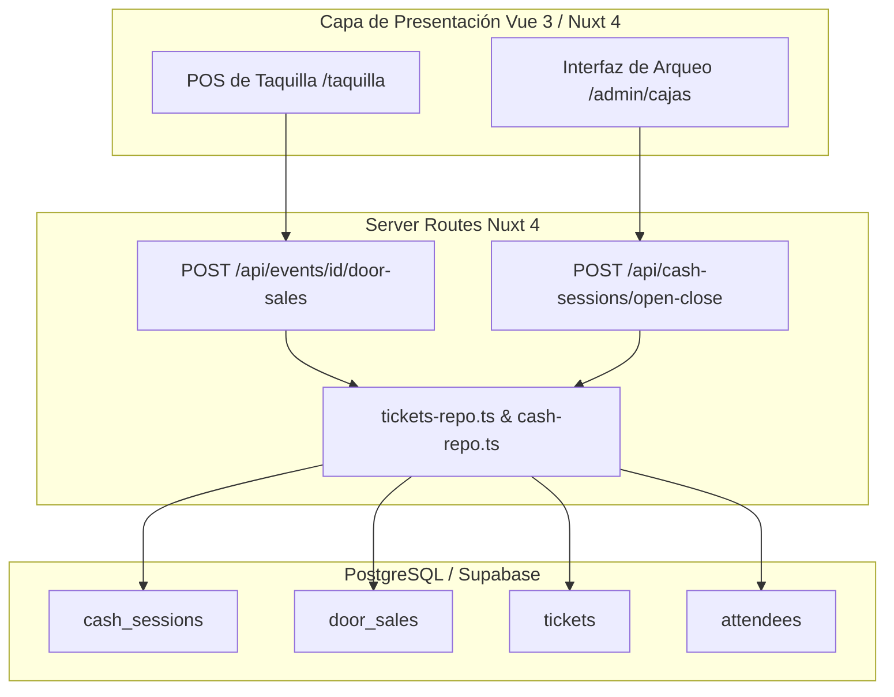
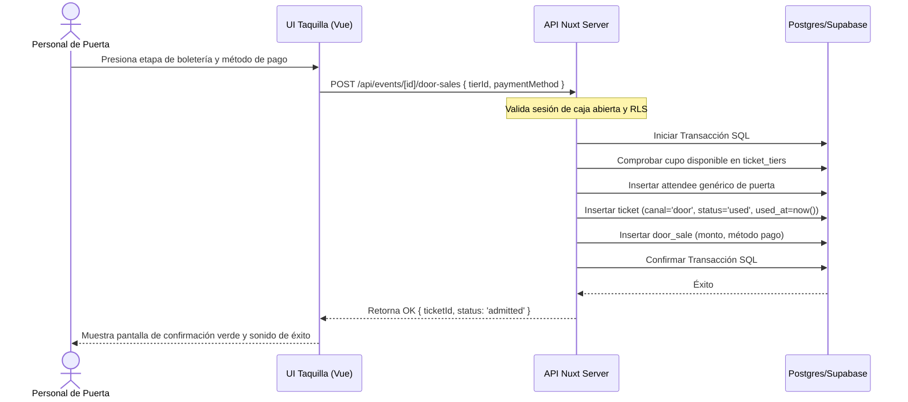

# Design Document: door-sales-and-cash-control

## Overview
Este documento detalla el diseño técnico para la implementación de la venta presencial en taquilla (puerta) y el control de sesiones de caja (turnos) para el staff de puerta (GATE_STAFF). La solución introduce un panel simplificado tipo punto de venta (POS) y endpoints atómicos en el servidor que registran transacciones presenciales directamente como tickets usados, sincronizando el aforo en tiempo real y garantizando la auditoría financiera del efectivo recaudado mediante sesiones de apertura y cierre de caja.

### Goals
- Proveer una interfaz POS táctil y responsiva para que el staff registre ventas en puerta en menos de 3 segundos por transacción.
- Garantizar la trazabilidad y arqueo de caja de los operarios mediante sesiones de caja con control de descuadres (sobrantes y faltantes).
- Mantener la sincronización del aforo del evento en tiempo real en los reportes administrativos consolidados.
- Mantener el aislamiento multi-tenant a través de políticas RLS y herencia de contexto de empresa (`company_id`).

### Non-Goals
- Integración automática con hardware de datáfonos o pasarelas de cobro físico por tarjeta.
- Generación de archivos PDF o envío de correos electrónicos para compras realizadas en puerta.

---

## Boundary Commitments

### This Spec Owns
- El ciclo de vida y los estados de las sesiones de caja (`cash_sessions`).
- El registro de las transacciones financieras en puerta (`door_sales`).
- El endpoint atómico de venta rápida en puerta y la generación del asistente genérico para puente de aforo.
- La UI del POS de taquilla y la UI de administración y arqueo de cajas del evento.

### Out of Boundary
- La validación criptográfica de códigos QR de tickets de preventa en línea (propiedad de `ticketing-checkin`).
- El procesamiento o dispersión bancaria de los pagos reportados en tarjeta.

### Allowed Dependencies
- `platform-foundation` para la resolución del tenant (`company_id`), sesión del usuario y roles (`GATE_STAFF`, `EVENT_MANAGER`).
- `event-management` para la validación de cupos de las etapas de boletería (`ticket_tiers`).

### Revalidation Triggers
- Modificaciones en la estructura de la tabla `tickets` o en las claves foráneas de `ticket_tiers`.
- Cambios en las políticas RLS globales de la plataforma que alteren el acceso de los operarios a las tablas de eventos.

---

## Architecture

### Architecture Pattern & Boundary Map



### Technology Stack

| Layer | Choice / Version | Role in Feature | Notes |
| :--- | :--- | :--- | :--- |
| Frontend | Nuxt 4 + Tailwind CSS | Interfaz POS y panel de cierre | Optimizado para móviles y taps rápidos |
| Backend | Nuxt Server Routes (h3) | API de transacciones y sesiones | Procesamiento server-side con Supabase Client |
| Data | PostgreSQL (Supabase) | Tablas de sesiones, ventas y alteración de tickets | Aislamiento por RLS a nivel de base de datos |

---

## File Structure Plan

### Directory Structure
```
app/
├── pages/
│   └── events/
│       └── [id]/
│           ├── taquilla.vue       # UI POS para la venta rápida en puerta
│           └── cajas.vue          # UI de administración y arqueo de turnos
server/
├── api/
│   ├── cash-sessions/
│   │   ├── index.get.ts           # Listar sesiones de caja del evento (Admin)
│   │   ├── active.get.ts          # Obtener sesión activa del usuario
│   │   ├── close.post.ts          # Cerrar sesión de caja y registrar arqueo
│   │   └── open.post.ts           # Abrir sesión de caja con saldo base
│   └── events/
│       └── [id]/
│           └── door-sales.post.ts # Endpoint atómico de venta rápida en puerta
└── utils/
    └── cash-repo.ts               # Funciones de base de datos para sesiones de caja
```

### Modified Files
- `supabase/migrations/0020_door_sales_and_cash_control.sql` (Nuevo archivo): Creación de tablas, RLS y triggers de auditoría.
- `app/types/ticketing.ts`: Extensión de tipos de TypeScript.
- `server/utils/tickets-repo.ts`: Función `sellTicketAtDoor` atómica.
- `server/api/events/[id]/dashboard.get.ts`: Inclusión de ingresos por venta en puerta.
- `app/pages/scan.vue`: Agregar botón para acceder a la taquilla rápida.

---

## System Flows

### Sequence: Venta Rápida y Registro en Puerta



---

## Requirements Traceability

| Requirement | Summary | Components | Interfaces | Flows |
| :--- | :--- | :--- | :--- | :--- |
| **1.1** | Apertura de caja | UI Taquilla / `cash-repo.ts` | `POST /api/cash-sessions/open` | Apertura de turno |
| **1.2** | Venta sin caja denegada | `door-sales.post.ts` | `POST /api/events/[id]/door-sales` | Control de sesión activa |
| **1.3** | Una sesión activa concurrente | `cash-repo.ts` | Restricción única en base de datos | Prevención de duplicación |
| **2.1** | Registro rápido en puerta | `tickets-repo.ts` (sellTicketAtDoor) | `POST /api/events/[id]/door-sales` | Flujo de venta y registro |
| **2.2** | Validación de cupos | `tickets-repo.ts` | Transacción SQL | Control de sobreventa |
| **2.3** | Indicador visual de éxito | UI Taquilla | Componente visual Vue 3 | Confirmación visual |
| **3.1** | Solicitud de efectivo de cierre | UI Cajas | `POST /api/cash-sessions/close` | Arqueo manual |
| **3.2** | Cálculo de descuadres | `cash-repo.ts` | Lógica server-side (monto esperado) | Registro de diferencias |
| **3.3** | Bloqueo de caja cerrada | `cash-repo.ts` & RLS | Restricción de trigger en base de datos | Bloqueo de escritura |
| **4.1** | Reportes unificados | `dashboard.get.ts` / UI Dashboard | `GET /api/events/[id]/dashboard` | Dashboard del evento |
| **4.2** | Restricciones de roles | `platform-foundation` / Nuxt Middleware | Roles de Supabase y RBAC | Control de acceso RLS |

---

## Components and Interfaces

### Server Services

#### [cash-repo.ts]
- **Intent**: Gestionar el estado de las sesiones de caja y el cálculo de arqueos de caja en taquilla.
- **Requirements**: 1.1, 1.3, 3.2, 3.3
- **Contracts**: Service
  ```typescript
  export interface CashSession {
    id: string;
    companyId: string;
    eventId: string;
    userId: string;
    openedAt: string;
    closedAt: string | null;
    openingBalance: number;
    closingBalanceExpected: number | null;
    closingBalanceReal: number | null;
    status: 'open' | 'closed';
  }
  
  export function getActiveSession(userId: string, eventId: string): Promise<CashSession | null>;
  export function openSession(userId: string, eventId: string, companyId: string, balance: number): Promise<CashSession>;
  export function closeSession(sessionId: string, realBalance: number): Promise<CashSession>;
  ```

#### [tickets-repo.ts (Extension)]
- **Intent**: Registrar de forma atómica la venta presencial de un ticket y marcar su ingreso inmediato.
- **Requirements**: 2.1, 2.2
- **Contracts**: Service
  ```typescript
  export interface DoorSaleResult {
    ticketId: string;
    status: 'admitted';
  }
  
  export function sellTicketAtDoor(
    eventId: string,
    tierId: string,
    sessionId: string,
    paymentMethod: 'cash' | 'card'
  ): Promise<DoorSaleResult>;
  ```

---

## Data Models

### Physical Data Model (PostgreSQL)

```sql
-- Alteración de la tabla tickets existente
ALTER TABLE public.tickets 
  ADD COLUMN IF NOT EXISTS channel text NOT NULL DEFAULT 'online' CHECK (channel IN ('online', 'door')),
  ADD COLUMN IF NOT EXISTS cash_session_id uuid;

-- Crear tabla de sesiones de caja
CREATE TABLE public.cash_sessions (
  id uuid PRIMARY KEY DEFAULT gen_random_uuid(),
  company_id uuid NOT NULL REFERENCES public.companies(id) ON DELETE CASCADE,
  event_id uuid NOT NULL REFERENCES public.events(id) ON DELETE CASCADE,
  user_id uuid NOT NULL REFERENCES auth.users(id) ON DELETE RESTRICT,
  opened_at timestamptz NOT NULL DEFAULT now(),
  closed_at timestamptz,
  opening_balance numeric(12, 2) NOT NULL DEFAULT 0.00 CHECK (opening_balance >= 0),
  closing_balance_expected numeric(12, 2) CHECK (closing_balance_expected >= 0),
  closing_balance_real numeric(12, 2) CHECK (closing_balance_real >= 0),
  status text NOT NULL DEFAULT 'open' CHECK (status IN ('open', 'closed')),
  created_at timestamptz NOT NULL DEFAULT now(),
  updated_at timestamptz NOT NULL DEFAULT now()
);

-- Crear tabla de transacciones de ventas en puerta
CREATE TABLE public.door_sales (
  id uuid PRIMARY KEY DEFAULT gen_random_uuid(),
  company_id uuid NOT NULL REFERENCES public.companies(id) ON DELETE CASCADE,
  event_id uuid NOT NULL REFERENCES public.events(id) ON DELETE CASCADE,
  cash_session_id uuid NOT NULL REFERENCES public.cash_sessions(id) ON DELETE CASCADE,
  ticket_id uuid NOT NULL REFERENCES public.tickets(id) ON DELETE CASCADE,
  amount numeric(12, 2) NOT NULL CHECK (amount >= 0),
  payment_method text NOT NULL CHECK (payment_method IN ('cash', 'card')),
  created_at timestamptz NOT NULL DEFAULT now()
);

-- Llave foránea en tickets apuntando a cash_sessions
ALTER TABLE public.tickets 
  ADD CONSTRAINT fk_tickets_cash_session 
  FOREIGN KEY (cash_session_id) 
  REFERENCES public.cash_sessions(id) 
  ON DELETE SET NULL;

-- Índice para asegurar una sola sesión abierta por operario a la vez por evento (Req 1.3)
CREATE UNIQUE INDEX cash_sessions_unique_active_user_idx 
  ON public.cash_sessions (event_id, user_id) 
  WHERE (status = 'open');
```

### Seguridad y RLS (Políticas)
- Habilitar RLS en `cash_sessions` y `door_sales`.
- Políticas para permitir a `GATE_STAFF` operar sobre su propio `user_id` y dentro del tenant `company_id`.
- Políticas para permitir a `EVENT_MANAGER`, `COMPANY_ADMIN` y `SUPER_ADMIN` leer todas las sesiones de caja y transacciones de su empresa.

---

## Error Handling

### Error Categories and Responses
- **Sesión de Caja Inactiva (400)**: Si se intenta registrar una venta en puerta sin una sesión activa, el servidor devuelve un error de tipo `CASH_SESSION_REQUIRED`.
- **Cupo Agotado (422)**: Si el aforo de la etapa se agota concurrentemente, devuelve `TIER_QUOTA_EXCEEDED`.
- **Acceso Denegado (403)**: Si un rol no autorizado intenta ver la sesión de caja de otro operario, se devuelve `FORBIDDEN`.

---

## Testing Strategy

### Unit / Integration Tests
- Validar que `openSession` asocie correctamente el `company_id` del evento y falle si ya hay una sesión activa.
- Validar que `sellTicketAtDoor` inserte de manera atómica el asistente genérico, el ticket en estado `used` y decremente el cupo del tier.
- Probar que el cierre de caja calcule la diferencia matemática esperada (`opening_balance + total_cash_sales`) contra el balance real provisto.
- Comprobar que no se puedan registrar ventas ni modificar transacciones tras cerrar la sesión.
