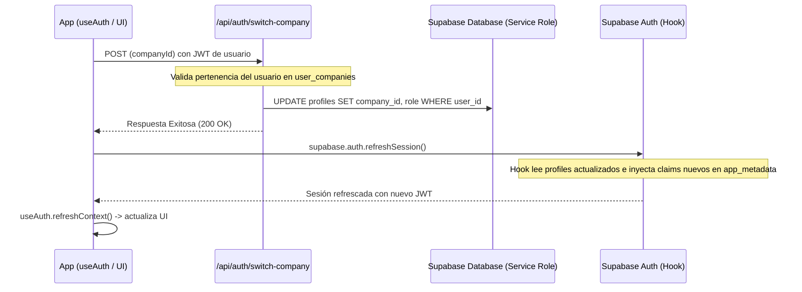

# Documento de Diseño

## Overview
**Purpose**: Esta especificación detalla la arquitectura de software, el modelo físico de datos y el mini design system para la transformación visual y estructural de la plataforma Vita Felix. Esto incluye la extensión del modelo de datos para soportar multiempresa con memberships e inicios de sesión cruzados, y la renovación de la interfaz completa mediante componentes reutilizables.

**Users**: Operadores del SaaS (`SUPER_ADMIN`), administradores de empresas organizadoras (`COMPANY_ADMIN`), gestores de eventos (`EVENT_MANAGER`) y personal de acceso (`GATE_STAFF`).

**Impact**: Modifica el esquema base agregando campos enterprise a `companies`, crea la tabla pivote `user_companies` y permite cambiar dinámicamente de tenant activo reescribiendo la fila `profiles` y refrescando la sesión Supabase. Introduce un design system unificado que reduce la dispersión de estilos y optimiza las vistas para móvil y escritorio.

### Goals
- Implementar la tabla `user_companies` y habilitar la asociación de usuarios a múltiples empresas con roles específicos.
- Implementar el mecanismo de cambio de empresa activa del usuario (tenant switching) sin alterar las políticas de RLS basadas en claims del JWT.
- Diseñar y construir un mini design system con 12 componentes UI consistentes bajo `/components/ui/`.
- Rediseñar el Login (dos columnas), el Sidebar responsivo por roles y los tres tipos de Dashboard (SaaS global, corporativo y de evento).
- Optimizar la experiencia del escáner QR en móviles agregando un modo pantalla completa y feedback visual por colores.

### Non-Goals
- Cambiar la tecnología base (Nuxt 4, Vue 3, Tailwind CSS v4, Supabase).
- Implementar pasarelas de pago, venta transaccional o facturación.
- Proveer análisis analíticos con inteligencia artificial.

## Boundary Commitments

### This Spec Owns
- Extensión del esquema de base de datos (`companies`, `user_companies`) y actualización de políticas RLS para membresías.
- Mecanismo server-side de cambio de tenant activo (`/api/auth/switch-company`) y refresh de sesión en cliente.
- Implementación de los 12 componentes del mini design system bajo `app/components/ui/`.
- Rediseño estético y responsivo de Login, default layout, Sidebar y dashboards administrativo, de empresa y de eventos.
- Implementación de las páginas de listado de empresas, creación/edición de empresas y gestión de usuarios corporativos.
- Rediseño visual del listado de eventos, detalle de evento con pestañas, boletería con progreso de aforo y escáner con alertas cromáticas.

### Out of Boundary
- Cambiar el core del validador criptográfico de QR o la firma de los tokens.
- Modificar el sistema de almacenamiento físico de PDFs en Supabase Storage.
- Alterar la lógica básica de creación de aforos y tickets; solo se cambia su presentación y progreso de aforo.

### Allowed Dependencies
- Supabase Auth, Postgres y Storage como infraestructura.
- Tailwind CSS v4 para el estilado.
- `@nuxtjs/supabase` como conector de cliente/servidor.

### Revalidation Triggers
- Cambios en el payload esperado por el Custom Access Token Hook.
- Modificaciones en la estructura de roles del sistema.
- Alteración de la ruta del SDK de Supabase o cookies SSR.

---

## Architecture

### Architecture Pattern & Boundary Map
El patrón de arquitectura se basa en la encapsulación de las consultas de datos en server-routes protegidas que validan roles y ejecutan consultas respetando las políticas RLS. Para el cambio de tenant dinámico, el cliente solicita la actualización de su perfil activo mediante un endpoint con service role y luego refresca la sesión Supabase localmente.



### Technology Stack
El stack tecnológico se mantiene idéntico al actual, potenciando el uso de Tailwind v4 y Nuxt 4:
- **Frontend**: Nuxt 4 (srcDir `app/`), Vue 3 (Composition API), Tailwind CSS v4 (utilidades integradas en assets/css/tailwind.css).
- **Backend**: Nuxt Server Routes (`server/api/`), Supabase JS SDK.
- **Base de Datos**: PostgreSQL en Supabase, RLS habilitado.

---

## File Structure Plan

### Directory Structure
```
vita_felix/
├── app/
│   ├── components/
│   │   └── ui/                          # Design System
│   │       ├── AppButton.vue
│   │       ├── AppCard.vue
│   │       ├── AppBadge.vue
│   │       ├── AppInput.vue
│   │       ├── AppSelect.vue
│   │       ├── AppTable.vue
│   │       ├── AppStatCard.vue
│   │       ├── AppPageHeader.vue
│   │       ├── AppEmptyState.vue
│   │       ├── AppConfirmModal.vue
│   │       ├── AppDropdownMenu.vue
│   │       └── AppProgressBar.vue
│   ├── composables/
│   │   ├── useCompanies.ts              # CRUD de Empresas
│   │   └── useUsers.ts                  # Gestión de Usuarios
│   └── pages/
│       ├── admin/
│       │   ├── companies/
│       │   │   ├── index.vue            # Listado de empresas
│       │   │   └── [id].vue             # Crear/Editar empresa
│       │   ├── users/
│       │   │   └── index.vue            # Gestión de usuarios
│       │   └── dashboard/
│       │       └── index.vue            # Dashboard Global Super Admin
│       └── events/
│           └── [id]/
│               ├── attendees.vue        # Listado de asistentes
│               └── dashboard.vue        # Dashboard de Evento
└── server/
    └── api/
        ├── auth/
        │   └── switch-company.post.ts   # Endpoint de cambio de tenant
        ├── companies/
        │   ├── index.get.ts             # Listado de empresas
        │   ├── index.post.ts            # Registro de empresa
        │   └── [id].put.ts              # Actualización de empresa
        ├── users/
        │   ├── index.get.ts             # Listado y filtros de usuarios
        │   ├── invite.post.ts           # Invitación/Creación de usuario
        │   └── [id].put.ts              # Edición de rol/estado de usuario
        └── dashboard.get.ts             # Datos unificados para dashboards
```

### Modified Files
- `app/layouts/default.vue`: Rediseño a sidebar oscuro con soporte responsivo y selector de empresa activa.
- `app/layouts/auth.vue`: Maquetación en dos columnas (métricas decorativas a la izquierda, formulario a la derecha).
- `app/components/AppNav.vue`: Agrupación de accesos por rol y categorías (GENERAL, OPERACIÓN, ANALÍTICA, SISTEMA).
- `app/pages/login.vue`: Estilado consistente y ajuste al nuevo layout.
- `app/pages/index.vue`: Rediseño para actuar como Dashboard del administrador de empresa (`COMPANY_ADMIN`).
- `app/pages/events/index.vue`: Listado mejorado con filtros, buscador, cards/tabla y menús de acción.
- `app/pages/events/[id]/index.vue`: Implementación de pestañas para Resumen, Boletería, Asistentes y Check-ins.
- `app/pages/events/[id]/tickets.vue`: Tarjetas de boletería, progreso de aforo y COP format.
- `app/pages/scan.vue`: Layout de portería a pantalla completa con feedback de semáforo de validación e historial.

---

## Requirements Traceability

| Requirement | Summary | Components |
|-------------|---------|------------|
| 1 | Base de datos multiempresa extendida | Migración `0012_enterprise_multitenancy.sql` |
| 2 | Sidebar y navegación por rol | `default.vue`, `AppNav.vue`, `app.config.ts` |
| 3 | Login dos columnas premium | `auth.vue`, `login.vue` |
| 4 | Dashboard Global (SUPER_ADMIN) | `/admin/dashboard/index.vue`, `dashboard.get.ts` |
| 5 | Dashboard Empresa y Evento | `index.vue`, `events/[id]/dashboard.vue` |
| 6 | Módulo de eventos mejorado | `events/index.vue` |
| 7 | Detalle de evento con pestañas | `events/[id]/index.vue` |
| 8 | Boletería con barra de progreso | `events/[id]/tickets.vue`, `AppProgressBar.vue` |
| 9 | Escáner modo operativo y feedback | `scan.vue`, `CheckinResult.vue` |
| 10 | Módulo de asistentes | `events/[id]/attendees.vue` |
| 11 | Componentes del Design System | `/components/ui/*` |
| 12 | Visualización Responsiva | Media queries y layouts adaptables |

---

## Data Models

### Physical Data Model
Se creará un script SQL de migración en la base de datos para agregar los nuevos campos y la tabla de memberships:

```sql
-- 0012_enterprise_multitenancy.sql

-- 1) Modificar la tabla companies existente
alter table public.companies 
add column if not exists legal_name text,
add column if not exists document_number text,
add column if not exists email text,
add column if not exists phone text,
add column if not exists city text,
add column if not exists country text default 'Colombia',
add column if not exists logo_url text,
add column if not exists plan text default 'free',
add column if not exists status text default 'active',
add column if not exists max_events integer default 3,
add column if not exists max_users integer default 3,
add column if not exists commission_percentage numeric(5,2) default 0;

-- 2) Crear tabla user_companies
create table if not exists public.user_companies (
  id uuid primary key default gen_random_uuid(),
  user_id uuid not null references auth.users(id) on delete cascade,
  company_id uuid not null references public.companies(id) on delete cascade,
  role public.app_role not null,
  status text not null default 'active',
  created_at timestamp with time zone not null default now(),
  unique (user_id, company_id)
);

-- Habilitar RLS
alter table public.user_companies enable row level security;
alter table public.user_companies force row level security;

-- Otorgar permisos base
grant select, insert, update, delete on public.user_companies to authenticated;

-- Políticas RLS para user_companies
create policy user_companies_select on public.user_companies
  for select to authenticated
  using (
    (select public.is_super_admin())
    or user_id = (select auth.uid())
    or company_id = (select public.auth_company_id())
  );

create policy user_companies_insert on public.user_companies
  for insert to authenticated
  with check (
    (select public.is_super_admin())
    or (
      company_id = (select public.auth_company_id()) 
      and (select public.auth_role()) = 'COMPANY_ADMIN'
    )
  );

create policy user_companies_update on public.user_companies
  for update to authenticated
  using (
    (select public.is_super_admin())
    or (
      company_id = (select public.auth_company_id()) 
      and (select public.auth_role()) = 'COMPANY_ADMIN'
    )
  );

create policy user_companies_delete on public.user_companies
  for delete to authenticated
  using (
    (select public.is_super_admin())
    or (
      company_id = (select public.auth_company_id()) 
      and (select public.auth_role()) = 'COMPANY_ADMIN'
    )
  );

-- 3) Actualizar políticas RLS de profiles para permitir gestión por COMPANY_ADMIN de su empresa
drop policy if exists profiles_insert on public.profiles;
drop policy if exists profiles_update on public.profiles;
drop policy if exists profiles_delete on public.profiles;

create policy profiles_insert on public.profiles
  for insert to authenticated
  with check (
    (select public.is_super_admin())
    or (
      (select public.auth_role()) = 'COMPANY_ADMIN'
      and company_id = (select public.auth_company_id())
    )
  );

create policy profiles_update on public.profiles
  for update to authenticated
  using (
    (select public.is_super_admin())
    or (
      (select public.auth_role()) = 'COMPANY_ADMIN'
      and company_id = (select public.auth_company_id())
    )
  );

create policy profiles_delete on public.profiles
  for delete to authenticated
  using (
    (select public.is_super_admin())
    or (
      (select public.auth_role()) = 'COMPANY_ADMIN'
      and company_id = (select public.auth_company_id())
    )
  );

-- 4) Rellenar datos históricos en user_companies basados en los perfiles actuales
insert into public.user_companies (user_id, company_id, role, status)
select id, company_id, role, 'active'
from public.profiles
where company_id is not null
on conflict (user_id, company_id) do nothing;
```

---

## Error Handling

### Error Strategy
- **Errores de Autenticación / Cambio de Tenant**: Si el cambio de tenant falla por problemas de red o RLS, se muestra una alerta persistente en el layout y se revierte la selección visual de la empresa.
- **Errores de Entrada / Validaciones**: Se gestionan con AppInput mostrando textos descriptivos debajo del campo con tonalidad roja (`text-rose-600`), previniendo clics duplicados mediante estados deshabilitados.
- **Errores del Escáner QR**: Las validaciones en puerta capturan excepciones de la cámara informando al usuario y habilitando automáticamente el campo de ingreso de ticket manual.

---

## Testing Strategy

### Unit Tests
- Pruebas en `app/utils/authz.spec.ts` para verificar la visibilidad correcta de los módulos del Sidebar según el rol inyectado.

### Integration Tests
- Validaciones en los endpoints de backend (`/api/auth/switch-company`) para asegurar que un usuario común no pueda cambiar su perfil activo a una empresa a la cual no está afiliado en `user_companies`.

### E2E / UI Tests
- Flujo de Login y navegación en dos columnas con simulación móvil en Playwright.
