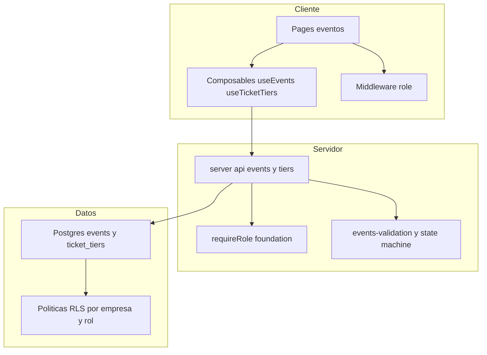
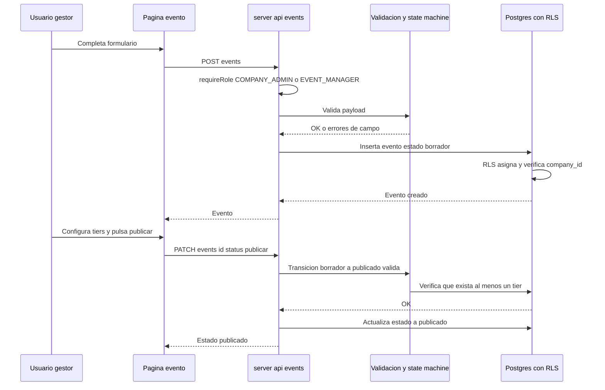
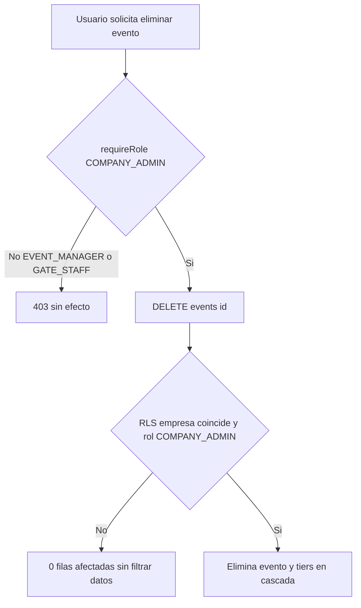

# Design Document

## Overview
**Purpose**: `event-management` entrega el catálogo de eventos musicales y sus etapas de boletería (ticket tiers) para cada empresa. Aporta el modelo de datos (`events`, `ticket_tiers`) con aislamiento multi-tenant, los server routes de CRUD y ciclo de vida, los composables de cliente y las pantallas de gestión (listado, crear/editar evento, configurar boletería).

**Users**: COMPANY_ADMIN y EVENT_MANAGER gestionan los eventos de su empresa; SUPER_ADMIN opera de forma transversal; GATE_STAFF no tiene acceso de gestión. La especificación `ticketing-checkin` consumirá los eventos publicados y sus tiers como catálogo.

**Impact**: Extiende la foundation sin modificar sus contratos. Reutiliza el patrón RLS, los helpers de claims (`auth_company_id`, `auth_role`, `is_super_admin`), las guardas server-side (`requireRole`) y la navegación por rol. Añade dos tablas, un enum de estado, server routes, composables y páginas nuevas.

### Goals
- Modelar `events` y `ticket_tiers` con aislamiento por empresa heredando el patrón de la foundation.
- CRUD server-side de eventos y tiers con autorización por rol y validación de entrada en el servidor.
- Ciclo de vida del evento (borrador → publicado → finalizado/cancelado) con transiciones validadas server-side.
- Pantallas de gestión integradas en el shell del Dashboard, con acciones filtradas por rol.

### Non-Goals
- Registro público de asistentes, tickets, QR, PDF, Storage y check-in (lo cubre `ticketing-checkin`).
- Pagos/cobro de boletas, facturación, conversión de moneda, reportería.
- Gestión de usuarios o empresas (provista/diferida por `platform-foundation`).
- Aforo total de evento (decisión de producto: cupo solo por tier).

## Boundary Commitments

### This Spec Owns
- Esquema de datos `public.events` y `public.ticket_tiers`, y el enum `public.event_status`.
- Políticas RLS de ambas tablas (aislamiento por empresa + defensa en profundidad por rol), reutilizando los helpers de la foundation.
- Server routes de gestión: CRUD de eventos, transiciones de estado y CRUD de tiers, bajo `requireRole`.
- Validación de entrada server-side (módulo puro y testeable) y la máquina de transiciones de estado.
- Composables `useEvents` / `useTicketTiers` y los tipos de dominio `Event`, `TicketTier`, `EventStatus`.
- Pantallas: listado de eventos, crear/editar evento, configurar boletería; entrada de navegación "Eventos".

### Out of Boundary
- Cualquier flujo público o de staff de puerta (registro, emisión de tickets, escaneo, check-in).
- Redefinir helpers de claims, el contrato `AuthContext`, o las políticas RLS de `companies`/`profiles`.
- Almacenamiento de archivos (Storage) y criptografía de QR/JWT de ticket.

### Allowed Dependencies
- `platform-foundation`: helpers RLS, `requireUser`/`requireRole`, `AuthContext`, tipos de rol, navegación por rol, módulo Supabase. **Esta spec depende de la foundation; no la modifica.**
- Supabase (Auth, PostgreSQL) y `@nuxtjs/supabase` 2.x.
- Nuxt 4 / Vue 3 / TypeScript (estricto) / Tailwind CSS.

### Revalidation Triggers
Cambios que obligarían a `ticketing-checkin` a re-verificar su integración:
- Cambios en el esquema de `events` o `ticket_tiers` (columnas, tipos, FKs) o en el enum `event_status`.
- Cambios en el contrato de los tipos `Event` / `TicketTier` consumidos aguas abajo.
- Cambios en qué estado de evento se considera "abierto al registro público" (hoy: `published`).
- Cambios en las políticas RLS de estas tablas que afecten la lectura por parte de GATE_STAFF en el check-in.

## Architecture

### Architecture Pattern & Boundary Map
Se mantiene la **arquitectura en capas con dirección de dependencias estricta** y la **defensa en profundidad** de la foundation. La lógica crítica (autorización, validación, transiciones de estado) vive en `server/`; los componentes Vue consumen únicamente vía composables.



**Architecture Integration**:
- Patrón seleccionado: capas (Types → DB/RLS → Server validation/utils → Server API → Composables → UI), idéntico a la foundation.
- Domain boundaries: este dominio posee el catálogo (eventos/tiers); reutiliza identidad y aislamiento de la foundation.
- New components rationale: la máquina de transiciones y la validación se extraen a módulos puros para testabilidad (mismo criterio que `authz.ts`).

### Dependency Direction
`types/events` → `DB (events, tiers, RLS)` → `server/utils (validation, state machine)` → `server/api/events` → `composables (useEvents, useTicketTiers)` → `pages/components`. Cada capa importa solo de capas a su izquierda. Reutiliza `~/types/auth`, `server/utils/auth` y los helpers RLS de la foundation (capa base a la izquierda).

### Technology Stack

| Layer | Choice / Version | Role in Feature | Notes |
|-------|------------------|-----------------|-------|
| Frontend | Nuxt 4 + Vue 3 + Tailwind CSS | Pages de eventos/boletería, composables, middleware `role` | `app/` como srcDir |
| Backend | Nuxt server routes (`server/api`), `@nuxtjs/supabase` 2.x | CRUD, transiciones, validación y autorización server-side | `serverSupabaseClient` (RLS por usuario) |
| Data | Supabase PostgreSQL (RLS) | `events`, `ticket_tiers`, enum `event_status` | RLS `enable`+`force` |
| Lenguaje | TypeScript (estricto) | Tipos e interfaces; prohibido `any` | Reutiliza tipos de la foundation |

## File Structure Plan

### Directory Structure
```
vita_felix/
├── app/
│   ├── types/
│   │   └── events.ts                         # EventStatus, Event, TicketTier, payloads (Create/Update)
│   ├── composables/
│   │   ├── useEvents.ts                       # list/get/create/update/remove/transición de estado
│   │   └── useTicketTiers.ts                  # list/create/update/remove de tiers de un evento
│   ├── pages/
│   │   └── events/
│   │       ├── index.vue                      # Listado de eventos de la empresa
│   │       ├── new.vue                        # Crear evento
│   │       └── [id]/
│   │           ├── index.vue                  # Editar evento + acciones de estado
│   │           └── tickets.vue                # Configurar boletería (tiers)
│   └── components/
│       └── events/
│           ├── EventForm.vue                  # Formulario crear/editar (presentacional)
│           ├── EventStatusBadge.vue           # Indicador de estado
│           └── TicketTierForm.vue             # Alta/edición de tier (presentacional)
├── server/
│   ├── api/
│   │   └── events/
│   │       ├── index.get.ts                   # Lista eventos (empresa del usuario / todos si SUPER_ADMIN)
│   │       ├── index.post.ts                  # Crea evento (COMPANY_ADMIN, EVENT_MANAGER)
│   │       └── [id]/
│   │           ├── index.get.ts               # Detalle de un evento + sus tiers
│   │           ├── index.put.ts               # Actualiza evento (COMPANY_ADMIN, EVENT_MANAGER)
│   │           ├── index.delete.ts            # Elimina evento (solo COMPANY_ADMIN)
│   │           ├── status.patch.ts            # Transición de estado (publicar/finalizar/cancelar)
│   │           └── tiers/
│   │               ├── index.get.ts           # Lista tiers del evento
│   │               ├── index.post.ts          # Crea tier (COMPANY_ADMIN, EVENT_MANAGER)
│   │               └── [tierId].put.ts        # Actualiza tier
│   │               └── [tierId].delete.ts     # Elimina tier
│   └── utils/
│       ├── events-validation.ts               # Validación pura de payloads (evento/tier) — testeable
│       ├── event-status.ts                    # Máquina de transiciones (pura) — testeable
│       └── events-repo.ts                      # Acceso a datos (serverSupabaseClient) encapsulado
└── supabase/
    └── migrations/
        ├── 0006_events.sql                    # enum event_status, tabla events, índices
        ├── 0007_ticket_tiers.sql              # tabla ticket_tiers, índices
        └── 0008_events_rls.sql                # RLS de events y ticket_tiers (empresa + rol)
```

### Modified Files
- `app/app.config.ts` — añadir `NavItem` "Eventos" (`/events`) visible para `SUPER_ADMIN`, `COMPANY_ADMIN`, `EVENT_MANAGER`.

## System Flows

### Crear y publicar un evento


### Eliminación por rol (defensa en profundidad)


## Requirements Traceability

| Requirement | Summary | Components | Interfaces | Flows |
|-------------|---------|------------|------------|-------|
| 1.1, 1.2, 1.3 | Aislamiento por empresa en lectura/escritura | RLS de events/tiers, helpers foundation | políticas SELECT/INSERT/UPDATE/DELETE | Eliminación por rol |
| 1.4 | SUPER_ADMIN transversal | RLS (`is_super_admin`) | cláusula de rol en políticas | — |
| 1.5, 1.6 | company_id automático; tier ligado a evento de la misma empresa | RLS `WITH CHECK`, FK | `events-repo`, FK `ticket_tiers.event_id` | Crear y publicar |
| 2.1, 2.2, 2.3 | Autorización por rol (admin/manager/gate) | `requireRole`, server routes | `requireRole(roles)` | Eliminación por rol |
| 2.4, 2.5 | Decisión server-side, denegación sin efecto | `requireRole`, RLS | 403 tipado | Eliminación por rol |
| 3.1, 3.2, 3.3, 3.4 | CRUD eventos + validación de campos | `index.post/put`, `events-validation` | `EventCreate`/`EventUpdate` | Crear y publicar |
| 3.5 | Eliminación en cascada (COMPANY_ADMIN) | `index.delete`, FK cascade | `DELETE /events/:id` | Eliminación por rol |
| 3.6 | Listado con campos clave | `index.get`, `useEvents` | `Event[]` | — |
| 4.1, 4.2, 4.3, 4.4, 4.5 | Estados y transiciones validadas | `event-status`, `status.patch` | `StatusTransition` | Crear y publicar |
| 4.6 | Solo `published` abierto al registro | `event-status` (`isOpenForRegistration`) | `EventStatus` | — |
| 5.1, 5.2, 5.3, 5.4, 5.5, 5.6 | CRUD tiers con precio/moneda/cupo | `tiers/*`, `events-validation`, `useTicketTiers` | `TierCreate`/`TierUpdate` | Crear y publicar |
| 6.1, 6.2, 6.3, 6.4, 6.5, 6.6 | Pantallas y acciones por rol | pages `events/*`, `EventForm`, `useAuthorization` | composables | — |
| 7.1, 7.2, 7.3, 7.4 | NFR seguridad/validación server-side | `requireRole`, RLS, `events-validation` | guardas + validación | Ambos flujos |

## Components and Interfaces

| Component | Domain/Layer | Intent | Req Coverage | Key Dependencies | Contracts |
|-----------|--------------|--------|--------------|------------------|-----------|
| Esquema events/ticket_tiers | Data | Catálogo multi-tenant | 1, 3, 5 | Postgres, esquema foundation (P0) | State |
| RLS de events/tiers | Data | Aislamiento por empresa + rol | 1, 2, 7 | helpers RLS foundation (P0) | State |
| `event-status` | Backend | Máquina de transiciones pura | 4 | — (P0) | Service |
| `events-validation` | Backend | Validación de payloads pura | 3, 5, 7 | tipos events (P0) | Service |
| `events-repo` | Backend | Acceso a datos encapsulado | 1, 3, 5 | `serverSupabaseClient` (P0) | Service |
| `server/api/events/**` | Backend | CRUD, estado y tiers server-side | 2, 3, 4, 5, 7 | `requireRole`, repo, validation (P0) | API |
| useEvents / useTicketTiers | Frontend | Estado y operaciones de cliente | 3, 4, 5, 6 | server/api (P0) | Service |
| Pages + componentes de eventos | Frontend/UI | Pantallas de gestión por rol | 6 | composables, `useAuthorization` (P0) | — |

### Data — Esquema events / ticket_tiers

| Field | Detail |
|-------|--------|
| Intent | Catálogo de eventos y etapas de boletería por empresa |
| Requirements | 1.1, 1.5, 1.6, 3.1, 3.2, 5.1, 5.2 |

**Responsibilities & Constraints**
- `events` pertenece a una `company`; `ticket_tiers` pertenece a un `event` (FK `on delete cascade`).
- `events.company_id` no nulo; lo fija/verifica RLS contra `auth_company_id()`.
- `ticket_tiers` deriva su empresa del evento; se desnormaliza `company_id` para simplificar y acelerar las políticas RLS (verificado contra el evento padre).
- `event_status` es un enum cerrado con cuatro valores.
- `price >= 0`, `quota >= 0`, `currency` formato ISO 4217 (3 letras mayúsculas).

**Contracts**: State [x]

##### State Management
- State model: ver Data Models (Physical Data Model).
- Persistence & consistency: integridad referencial `events.company_id → companies.id`, `ticket_tiers.event_id → events.id` (cascade), `ticket_tiers.company_id → companies.id`.
- Concurrency: escrituras administrativas infrecuentes; sin estrategia especial de concurrencia en esta spec (las cantidades vendidas se gestionan en `ticketing-checkin`).

### Backend — event-status (máquina de transiciones)

| Field | Detail |
|-------|--------|
| Intent | Definir y validar transiciones de estado del evento |
| Requirements | 4.1, 4.2, 4.4, 4.5, 4.6 |

**Contracts**: Service [x]

##### Service Interface
```typescript
export type EventStatus = 'draft' | 'published' | 'finished' | 'cancelled'

export type StatusAction = 'publish' | 'finish' | 'cancel'

// Transiciones permitidas: draft→published, draft→cancelled,
// published→finished, published→cancelled. finished/cancelled son terminales.
export function nextStatus(current: EventStatus, action: StatusAction): EventStatus | null
export function isTransitionAllowed(current: EventStatus, action: StatusAction): boolean
export function isOpenForRegistration(status: EventStatus): boolean // true solo si 'published'
```
- Preconditions: `current` es un `EventStatus` válido.
- Postconditions: devuelve el estado destino o `null` si la transición no está permitida (4.5).
- Invariants: `publish` requiere además ≥1 tier; esa verificación se hace en el server route con datos del repo (4.2, 4.3).

### Backend — events-validation

| Field | Detail |
|-------|--------|
| Intent | Validar payloads de evento y tier de forma pura y testeable |
| Requirements | 3.2, 3.3, 5.2, 5.3, 7.4 |

**Contracts**: Service [x]

##### Service Interface
```typescript
export interface FieldError { field: string; message: string }
export type ValidationResult<T> = { ok: true; value: T } | { ok: false; errors: FieldError[] }

export function validateEventInput(input: unknown): ValidationResult<EventWriteModel>
export function validateTierInput(input: unknown): ValidationResult<TierWriteModel>
```
- Reglas evento: `name` no vacío; `event_at` fecha/hora válida; `venue` no vacío. (3.2, 3.3)
- Reglas tier: `name` no vacío; `price` numérico `>= 0`; `currency` ISO 4217 (3 letras); `quota` entero `>= 0`. (5.2, 5.3)
- Devuelve la lista de campos inválidos; no lanza para errores de validación (el route mapea a 422).

### Backend — server/api/events/**

| Field | Detail |
|-------|--------|
| Intent | Exponer CRUD, transiciones y tiers con autorización por rol |
| Requirements | 2.1–2.5, 3.1–3.6, 4.x, 5.x, 7.x |

**Contracts**: API [x]

##### API Contract
| Method | Endpoint | Roles | Request | Response | Errors |
|--------|----------|-------|---------|----------|--------|
| GET | /api/events | cualquiera autenticado de la empresa | — | `Event[]` | 401 |
| POST | /api/events | COMPANY_ADMIN, EVENT_MANAGER | `EventCreate` | `Event` | 401, 403, 422 |
| GET | /api/events/:id | autenticado de la empresa | — | `Event & { tiers: TicketTier[] }` | 401, 404 |
| PUT | /api/events/:id | COMPANY_ADMIN, EVENT_MANAGER | `EventUpdate` | `Event` | 401, 403, 404, 422 |
| DELETE | /api/events/:id | COMPANY_ADMIN | — | `{ ok: true }` | 401, 403, 404 |
| PATCH | /api/events/:id/status | COMPANY_ADMIN, EVENT_MANAGER | `{ action: StatusAction }` | `Event` | 401, 403, 404, 409, 422 |
| GET | /api/events/:id/tiers | autenticado de la empresa | — | `TicketTier[]` | 401, 404 |
| POST | /api/events/:id/tiers | COMPANY_ADMIN, EVENT_MANAGER | `TierCreate` | `TicketTier` | 401, 403, 404, 422 |
| PUT | /api/events/:id/tiers/:tierId | COMPANY_ADMIN, EVENT_MANAGER | `TierUpdate` | `TicketTier` | 401, 403, 404, 422 |
| DELETE | /api/events/:id/tiers/:tierId | COMPANY_ADMIN, EVENT_MANAGER | — | `{ ok: true }` | 401, 403, 404 |

**Implementation Notes**
- Cada route llama `requireRole` con los roles permitidos antes de operar (2.4). Las lecturas usan `requireUser` (la empresa la impone RLS).
- Transición de estado inválida → 409; payload inválido → 422 con `errors` (campo/mensaje), sin filtrar datos de otras empresas (2.5, 7.3).
- `events-repo` usa `serverSupabaseClient(event)` (RLS por usuario): el aislamiento por empresa lo aplica la DB, no el código (1.3, 7.2).

### Frontend — Composables y UI

| Field | Detail |
|-------|--------|
| Intent | Operaciones de catálogo y pantallas de gestión por rol |
| Requirements | 3.6, 4.x, 5.5, 6.1–6.6 |

**Responsibilities & Constraints**
- `useEvents`: `list`, `get`, `create`, `update`, `remove`, `setStatus`; consume `/api/events/**` vía `$fetch`.
- `useTicketTiers`: `list`, `create`, `update`, `remove` para los tiers de un evento.
- Pantallas usan `useAuthorization().can([...])` para mostrar/ocultar acciones; la eliminación de eventos se oculta/deshabilita para EVENT_MANAGER (6.6). Las páginas de gestión declaran `meta.requiredRoles` para el middleware `role`.
- Componentes presentacionales (`EventForm`, `TicketTierForm`) sin lógica de negocio; la validación real es server-side, con validación de UX en el formulario (6.3, 6.4).

**Contracts**: Service [x] (composables)

## Data Models

### Domain Model
- **Aggregate `Event`**: pertenece a una `Company`; posee `TicketTier`s; tiene un `EventStatus`.
- **Entity `TicketTier`**: etapa de boletería de un `Event` (nombre, precio, moneda, cupo).
- **Value/Enum `EventStatus`**: { draft, published, finished, cancelled }.
- Invariantes: un `Event` siempre referencia una `Company`; un `TicketTier` siempre referencia un `Event` de la misma empresa; publicar exige ≥1 `TicketTier`.

### Physical Data Model (PostgreSQL)
```sql
create type public.event_status as enum ('draft','published','finished','cancelled');

create table public.events (
  id          uuid primary key default gen_random_uuid(),
  company_id  uuid not null references public.companies(id) on delete cascade,
  name        text not null check (length(btrim(name)) > 0),
  venue       text not null check (length(btrim(venue)) > 0),
  event_at    timestamptz not null,
  status      public.event_status not null default 'draft',
  description text,
  created_at  timestamptz not null default now(),
  updated_at  timestamptz not null default now()
);
create index events_company_id_idx on public.events (company_id, id);

create table public.ticket_tiers (
  id          uuid primary key default gen_random_uuid(),
  event_id    uuid not null references public.events(id) on delete cascade,
  company_id  uuid not null references public.companies(id) on delete cascade,
  name        text not null check (length(btrim(name)) > 0),
  price       numeric(12,2) not null default 0 check (price >= 0),
  currency    char(3) not null check (currency ~ '^[A-Z]{3}$'),
  quota       integer not null default 0 check (quota >= 0),
  created_at  timestamptz not null default now(),
  updated_at  timestamptz not null default now()
);
create index ticket_tiers_event_id_idx on public.ticket_tiers (event_id);
create index ticket_tiers_company_id_idx on public.ticket_tiers (company_id, event_id);
```
- `ticket_tiers.company_id` se desnormaliza desde el evento padre para que las políticas RLS comparen directamente contra `auth_company_id()` sin subconsultas por fila; un trigger/`WITH CHECK` garantiza que coincida con `events.company_id`.

### RLS (patrón heredado + defensa en profundidad por rol)
```sql
-- events: SELECT por empresa (cualquier rol autenticado de la empresa) o SUPER_ADMIN.
-- INSERT/UPDATE: COMPANY_ADMIN o EVENT_MANAGER de la empresa. DELETE: solo COMPANY_ADMIN.
-- ticket_tiers: mismo patrón; company_id verificado contra el evento padre.
```
- Helpers reutilizados: `(select public.auth_company_id())`, `(select public.auth_role())`, `(select public.is_super_admin())`.
- RLS `enable` + `force` en ambas tablas; grants base a `authenticated`.

### Data Contracts & Integration
```typescript
export interface Event {
  id: string
  companyId: string
  name: string
  venue: string
  eventAt: string        // ISO 8601
  status: EventStatus
  description: string | null
  createdAt: string
  updatedAt: string
}
export interface TicketTier {
  id: string
  eventId: string
  companyId: string
  name: string
  price: number          // >= 0
  currency: string       // ISO 4217 (3 letras)
  quota: number          // entero >= 0
  createdAt: string
  updatedAt: string
}
```
- `Event` y `TicketTier` son el contrato consumido por `ticketing-checkin` (registro público y emisión de tickets).

## Error Handling

### Error Strategy
- **User/Validation (422)**: payloads inválidos → `{ errors: FieldError[] }` (campo + mensaje), sin filtrar datos de otras empresas (3.3, 5.3, 7.3).
- **AuthZ (401/403)**: sin sesión → 401; rol no permitido → 403 sin efecto ni filtrado (2.4, 2.5, 7.1, 7.3).
- **Not found (404)**: recurso inexistente o de otra empresa → 404 (no se revela existencia; RLS devuelve 0 filas) (1.2).
- **Conflict (409)**: transición de estado no permitida o publicar sin tiers → 409 con mensaje (4.3, 4.5).
- **System (5xx)**: errores de Supabase → mensaje controlado y registro server-side.

### Monitoring
- Registro server-side de denegaciones de autorización y transiciones inválidas (sin datos sensibles).

## Testing Strategy

### Unit Tests
- `event-status`: matriz de transiciones (permitidas/denegadas) y `isOpenForRegistration` solo true en `published` — cubre 4.1, 4.4, 4.5, 4.6.
- `events-validation`: evento sin nombre/fecha/lugar → errores; tier con precio negativo, cupo negativo, moneda inválida, nombre vacío → errores; casos válidos → `ok` — cubre 3.2, 3.3, 5.2, 5.3.

### Integration Tests (Postgres harness)
- RLS: usuario de empresa A no lee ni escribe eventos/tiers de empresa B; SUPER_ADMIN sí — cubre 1.1–1.4.
- RLS por rol: EVENT_MANAGER inserta/actualiza pero su DELETE de evento no afecta filas; GATE_STAFF no escribe — cubre 2.1, 2.2, 2.3.
- `WITH CHECK`: crear evento fuerza `company_id` del usuario; tier hereda y verifica la empresa del evento — cubre 1.5, 1.6.

### E2E / UI Tests
- Crear evento (borrador) → aparece en el listado con estado; configurar un tier; publicar → estado `published` — cubre 3.1, 3.6, 4.2, 5.1, 6.1, 6.5.
- Publicar sin tiers → error 409 visible — cubre 4.3.
- EVENT_MANAGER no ve/usa la acción eliminar evento; COMPANY_ADMIN sí — cubre 2.2, 6.6.

## Security Considerations
- Autorización por rol 100% server-side (`requireRole`); las guardas de UI son solo UX (7.2).
- Defensa en profundidad: RLS aísla por empresa y restringe escritura por rol; el server route es la autorización primaria.
- Validación de entrada server-side independiente del cliente (7.4); errores sin filtrar datos de otras empresas (7.3).
- Reutiliza el contrato de identidad y los helpers de la foundation sin debilitarlos.
