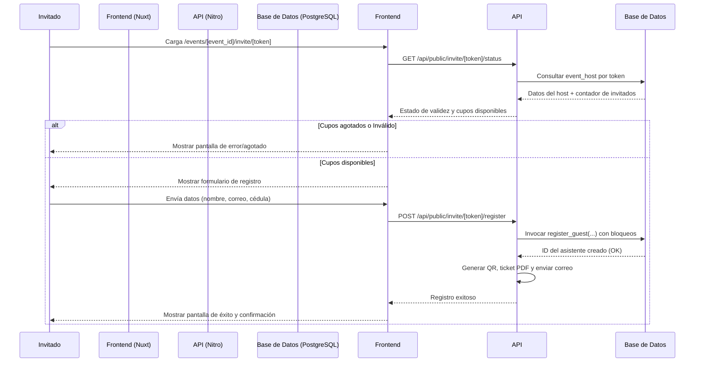

# Design Document: Lista de Invitaciones y Cortesías

## Overview
Este diseño técnico especifica la implementación de la característica de lista de invitados y cortesías automatizadas. Resuelve la recopilación manual e informal de datos de invitados especiales (DJs, socios, relaciones públicas) mediante enlaces de invitación individuales protegidos por un token seguro y con control de cupos atómico en base de datos.

### Goals
- Permitir la creación de anfitriones (`event_hosts`) con límites de cortesías configurables por evento.
- Generar URLs web de invitación únicas e imposibles de adivinar utilizando tokens seguros.
- Automatizar la captura de datos (nombre, correo, cédula) del invitado a través de un formulario público y validado.
- Garantizar a nivel transaccional en base de datos que el número de registros no exceda el límite asignado al anfitrión.
- Emitir automáticamente la boleta de cortesía y enviarla por correo al invitado.

### Non-Goals
- Crear cuentas de usuario o paneles de acceso dedicados para los anfitriones (DJs/socios).
- Controlar el aforo global del evento en el formulario de invitaciones (se delega a la validación de aforo global existente del sistema).

## Boundary Commitments

### This Spec Owns
- El ciclo de vida de los anfitriones (`event_hosts`) y la asignación de sus cupos de cortesías.
- La validación del token de invitación seguro en el frontend y backend.
- La transacción atómica para validar cupos y registrar asistentes vinculados a un anfitrión.
- Las páginas de UI correspondientes al formulario de registro del invitado y a la creación de anfitriones en el dashboard del administrador.

### Out of Boundary
- El envío de correos electrónicos con el ticket PDF (se delega al servicio de correos existente).
- La lógica de cifrado y hashing de la cédula (se delega a `attendee-crypto.ts`).
- La validación del ticket en puerta (se delega al sistema de check-in existente).

### Allowed Dependencies
- `supabase-js` para operaciones en base de datos.
- `@supabase/ssr` para autenticación del administrador.
- `h3` y `nuxt` para API endpoints y rutas del lado del cliente.
- `pdf-lib` y `qrcode` (a través de `ticket-pdf.ts`) para la emisión de las cortesías.

## Architecture

### Existing Architecture Analysis
La aplicación utiliza un backend de Nuxt Server con controladores de repositorio en `server/utils/` (`tickets-repo.ts`, `events-repo.ts`) y clientes de Supabase con Service Role y sesión de usuario. El frontend está estructurado en páginas de Nuxt con Tailwind CSS. Este diseño introduce una tabla y repositorio de anfitriones que se integran de manera natural en este esquema.

### Technology Stack
- **Backend / Services**: Nuxt API Server (Nitro) + Repositorio local `event-hosts-repo.ts`.
- **Data / Storage**: PostgreSQL (Supabase) con políticas RLS y función transaccional de registro.
- **Frontend**: Nuxt 3 (Vue 3) + Tailwind CSS.

## File Structure Plan

### Directory Structure
```
server/
├── api/
│   ├── events/
│   │   └── [id]/
│   │       ├── hosts.get.ts      # Listado de anfitriones de un evento (admin)
│   │       └── hosts.post.ts     # Registrar nuevo anfitrión (admin)
│   └── public/
│       └── invite/
│           └── [token]/
│               ├── status.get.ts   # Validar token e invitados restantes (público)
│               └── register.post.ts # Registro final del invitado (público)
├── utils/
│   └── event-hosts-repo.ts       # Repositorio para transacciones de event_hosts [NEW]
supabase/
└── migrations/
    └── 0017_guest_list_invitations.sql # Migración de base de datos [NEW]
app/
└── pages/
    ├── admin/
    │   └── dashboard/
    │       └── events/
    │           └── [id]/
    │               └── hosts.vue # Gestión de anfitriones por evento (admin) [NEW]
    └── events/
        └── [event_id]/
            └── invite/
                └── [token].vue   # Formulario web de registro para invitados [NEW]
```

## Data Models

### Physical Data Model (PostgreSQL)

```sql
-- supabase/migrations/0017_guest_list_invitations.sql

create table public.event_hosts (
  id                  uuid primary key default gen_random_uuid(),
  company_id          uuid not null references public.companies(id) on delete cascade,
  event_id            uuid not null references public.events(id) on delete cascade,
  name                text not null check (length(btrim(name)) > 0),
  role                text not null default 'PR',
  max_guests          integer not null check (max_guests > 0),
  token               text not null default encode(gen_random_bytes(16), 'hex'),
  created_at          timestamptz not null default now(),
  unique (event_id, token)
);

alter table public.attendees 
  add column host_id uuid references public.event_hosts(id) on delete set null;

-- Habilitar RLS en event_hosts
alter table public.event_hosts enable row level security;

-- Política de RLS para event_hosts
create policy "EVENT_MANAGER y SUPER_ADMIN pueden gestionar hosts de su empresa"
  on public.event_hosts
  for all
  using (company_id = auth.jwt() -> 'app_metadata' ->> 'company_id');

-- Permitir lectura anónima de event_hosts mediante token seguro
create policy "Lectura pública de host mediante token"
  on public.event_hosts
  for select
  using (true);
```

### Función SQL Atómica de Registro: `register_guest`
Esta función PostgreSQL se ejecuta del lado del servidor para garantizar que la verificación de cupos y el registro sea atómico (evitando condiciones de carrera).

```sql
create or replace function public.register_guest(
  p_event_id uuid,
  p_token text,
  p_full_name text,
  p_email text,
  p_cedula_enc text,
  p_cedula_hash text
) returns uuid as $$
declare
  v_host_id uuid;
  v_company_id uuid;
  v_max_guests integer;
  v_current_guests integer;
  v_tier_id uuid;
  v_attendee_id uuid;
begin
  -- 1. Obtener y bloquear la fila del anfitrión para evitar registros concurrentes
  select id, company_id, max_guests into v_host_id, v_company_id, v_max_guests
  from public.event_hosts
  where event_id = p_event_id and token = p_token
  for update;

  if v_host_id is null then
    raise exception 'Enlace de invitación no válido.' using errcode = 'P0002';
  end if;

  -- 2. Validar cupos actuales
  select count(*) into v_current_guests
  from public.attendees
  where host_id = v_host_id;

  if v_current_guests >= v_max_guests then
    raise exception 'Las invitaciones para este enlace se han agotado.' using errcode = 'P0003';
  end if;

  -- 3. Buscar tier de cortesía configurado para el evento
  select id into v_tier_id
  from public.ticket_tiers
  where event_id = p_event_id and name ilike '%cortesia%'
  limit 1;
  
  if v_tier_id is null then
    raise exception 'No se encontró la categoría de cortesía en el evento.' using errcode = 'P0004';
  end if;

  -- 4. Insertar asistente
  insert into public.attendees (company_id, event_id, full_name, email, cedula_enc, cedula_hash, host_id)
  values (v_company_id, p_event_id, p_full_name, p_email, p_cedula_enc, p_cedula_hash, v_host_id)
  returning id into v_attendee_id;

  -- 5. Crear ticket
  insert into public.tickets (company_id, event_id, tier_id, attendee_id, status)
  values (v_company_id, p_event_id, v_tier_id, v_attendee_id, 'valid');

  return v_attendee_id;
end;
$$ language plpgsql security definer;
```

## System Flows

### Diagrama de Secuencia: Registro de Invitado


## Error Handling
- **Enlace Inválido (404)**: Si el token de invitación no corresponde a ningún anfitrión del evento seleccionado.
- **Cupos Agotados (422)**: Si el límite de invitados para el anfitrión ha sido alcanzado.
- **Cédula Duplicada (409)**: Si el invitado ya tiene un ticket para el evento.

## Testing Strategy

### Unit Tests
- Pruebas en `event-hosts-repo.spec.ts` para verificar la inserción de anfitriones y la validación de tokens correctos/incorrectos.
- Pruebas unitarias de validación de entradas de datos para el formulario de invitado.

### Integration Tests
- Validar el comportamiento concurrente de la función SQL `register_guest` (comprobando que no se registren más invitados de los permitidos ante llamadas simultáneas).
- Comprobar la correcta asociación entre el ticket emitido y el `host_id` del anfitrión.
