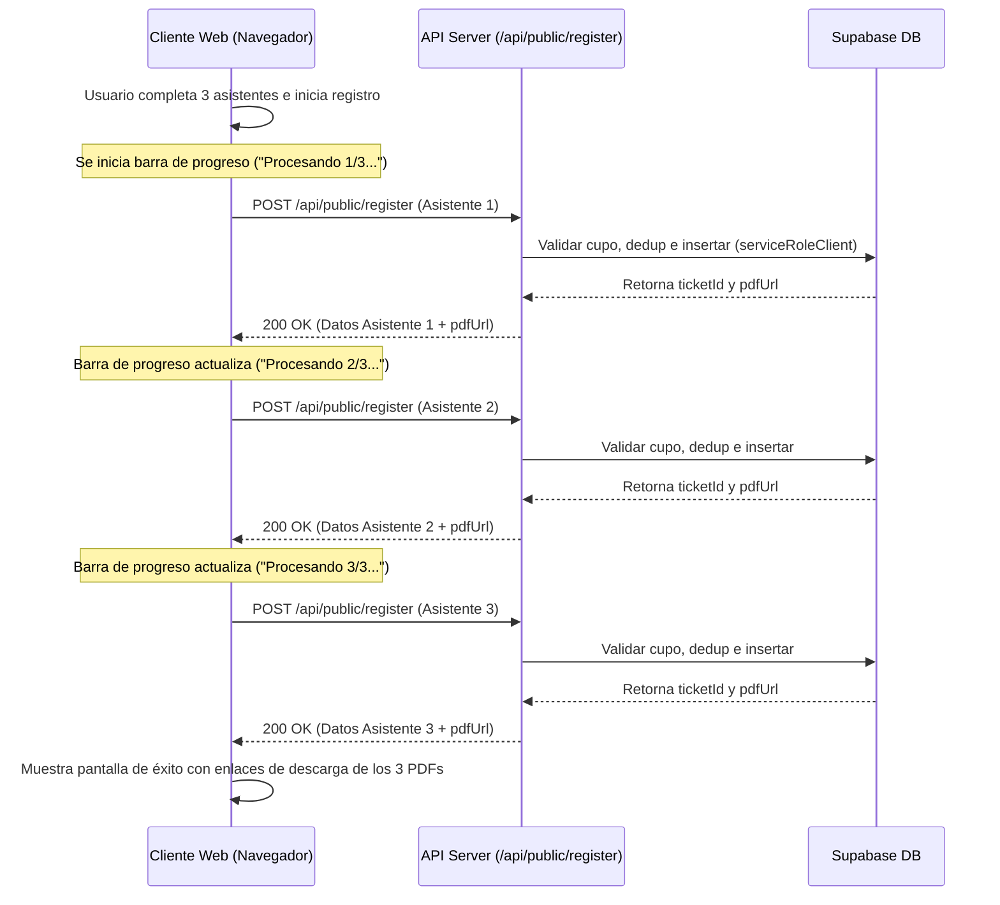

# Documento de Diseño

## Overview
Este diseño detalla la arquitectura para implementar la emisión manual de tickets en el panel admin, registros en grupo en el portal público y el soporte de flyers HD en Vita Felix.

### Goles
- Permitir que un administrador emita manualmente tickets para un evento y obtenga un enlace PDF listo para WhatsApp.
- Permitir que los usuarios en el portal público se registren a sí mismos y a acompañantes de forma simultánea.
- Incorporar un campo de flyer HD a los eventos y mostrarlo en la interfaz de registro de manera atractiva y premium.

---

## Límite de Responsabilidad (Boundary Commitments)

### Este Spec Provee
- Columna `flyer_url` en la tabla `events` de Supabase.
- Endpoint administrativo `POST /api/events/[id]/attendees` para registro manual de tickets.
- Componente de formulario de registro público adaptado para múltiples asistentes.
- Rediseño de la página de registro público del evento para desplegar el flyer HD.

### Fuera de este Spec
- Cargas directas de archivos binarios al storage desde la interfaz de eventos (se utiliza URL de imagen).

---

## Arquitectura

### Cambios en el Modelo Físico de Datos
Se agregará una nueva columna a la tabla de eventos existente.

```sql
alter table public.events add column if not exists flyer_url text;
```

---

## File Structure Plan

### Nuevos Archivos
- **[0013_event_flyer.sql](file:///Users/juandresbo/_Developer/vita_felix/supabase/migrations/0013_event_flyer.sql)**: Archivo SQL para la migración del campo de flyer en base de datos.
- **[attendees.post.ts](file:///Users/juandresbo/_Developer/vita_felix/server/api/events/[id]/attendees.post.ts)**: Endpoint administrativo para la emisión manual de tickets.

### Archivos Modificados
- **[database.types.ts](file:///Users/juandresbo/_Developer/vita_felix/app/types/database.types.ts)**: Agregar `flyer_url` a los tipos TypeScript de Supabase.
- **[events.ts](file:///Users/juandresbo/_Developer/vita_felix/app/types/events.ts)**: Agregar `flyerUrl` a los modelos lógicos de eventos.
- **[ticketing.ts](file:///Users/juandresbo/_Developer/vita_felix/app/types/ticketing.ts)**: Agregar `flyerUrl` al modelo público.
- **[events-repo.ts](file:///Users/juandresbo/_Developer/vita_felix/server/utils/events-repo.ts)**: Incluir `flyer_url` en queries CRUD de eventos de base de datos.
- **[tickets-repo.ts](file:///Users/juandresbo/_Developer/vita_felix/server/utils/tickets-repo.ts)**: Incluir `flyer_url` en `getPublicEvent`.
- **[events-validation.ts](file:///Users/juandresbo/_Developer/vita_felix/server/utils/events-validation.ts)**: Validar `flyerUrl` opcional en la entrada de datos de eventos.
- **[index.vue (Events Details)](file:///Users/juandresbo/_Developer/vita_felix/app/pages/events/[id]/index.vue)**: Agregar input de Flyer URL y previsualización.
- **[attendees.vue](file:///Users/juandresbo/_Developer/vita_felix/app/pages/events/[id]/attendees.vue)**: Agregar botón "Registrar Asistente", el modal con formulario e integración para copiar enlace de WhatsApp.
- **[RegistrationForm.vue](file:///Users/juandresbo/_Developer/vita_felix/app/components/ticketing/RegistrationForm.vue)**: Reestructurar el formulario público para soportar acompañantes.
- **[register.vue](file:///Users/juandresbo/_Developer/vita_felix/app/pages/e/[eventId]/register.vue)**: Rediseño a layout de doble columna (flyer HD a la izquierda y formulario a la derecha), con barra de progreso de registros en lote.

---

## Flujos del Sistema

### Flujo de Registro Grupal (Secuencial en Lote)



---

## Contratos de Componentes e Interfaces

### API Administrativa: Registro Manual
`POST /api/events/[id]/attendees`

**Encabezados**: Sesión autenticada.
**Roles autorizados**: `SUPER_ADMIN`, `COMPANY_ADMIN`, `EVENT_MANAGER`

**Request Body**:
```typescript
interface ManualRegistrationRequest {
  fullName: string
  cedula: string
  email: string
  tierId: string
}
```

**Response Body (200 OK)**:
```typescript
interface ManualRegistrationResponse {
  ticketId: string
  pdfUrl: string
}
```

---

## Estrategia de Pruebas

### Pruebas Unitarias
- Validar en `events-validation.spec.ts` que el campo `flyerUrl` acepte formatos correctos de URL o cadenas vacías y rechace otros tipos.
- Asegurar que la inserción y actualización en `events-repo` persista el campo `flyer_url` correctamente.

### Pruebas Manuales
- Verificar en consola de base de datos que se aplique la migración de base de datos exitosamente.
- Probar el flujo completo de registro grupal (3 asistentes en lote) en el portal de eventos con y sin cédulas repetidas para verificar la detención del proceso y el manejo de errores individuales.
- Probar la emisión manual de entradas desde el administrador y verificar que el portapapeles copie correctamente el mensaje de WhatsApp.
