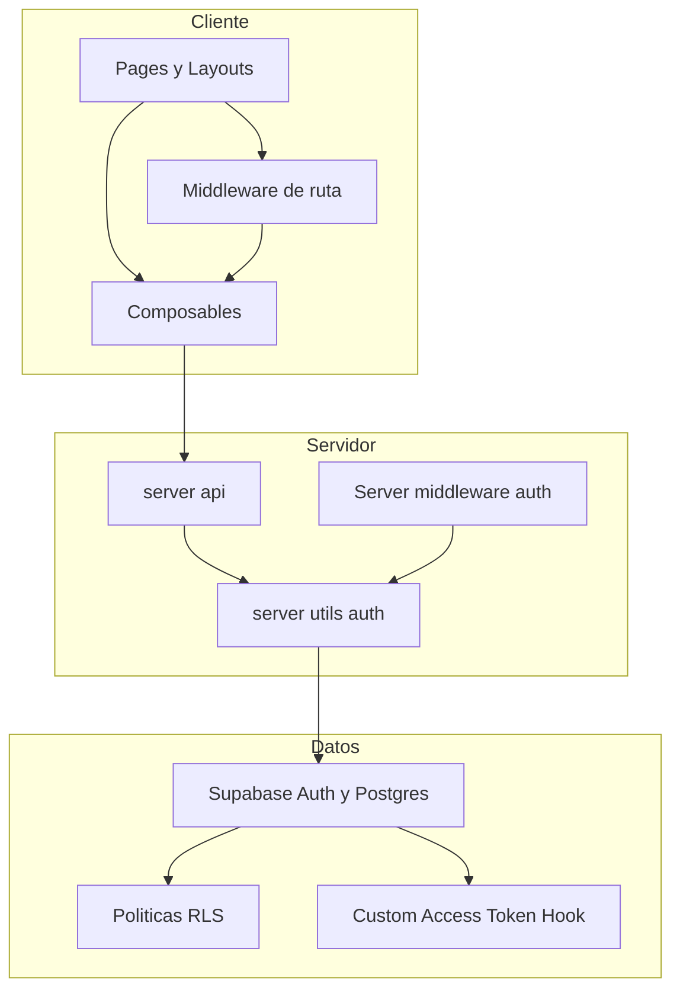
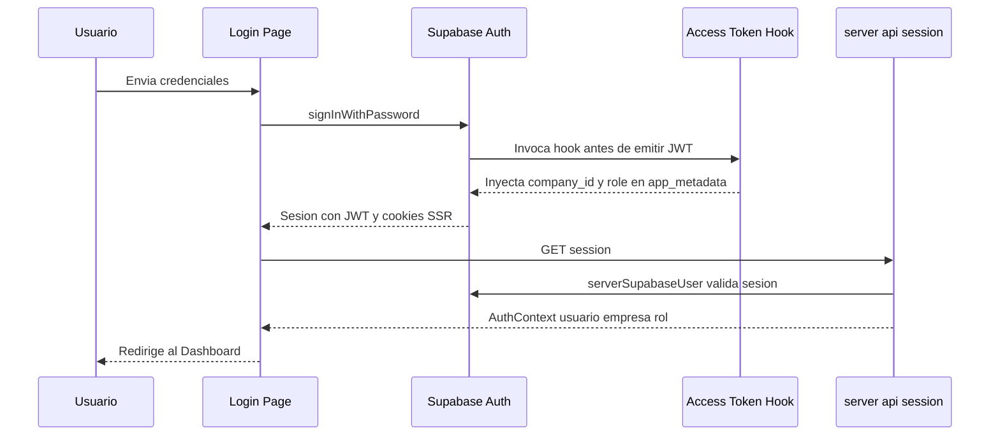
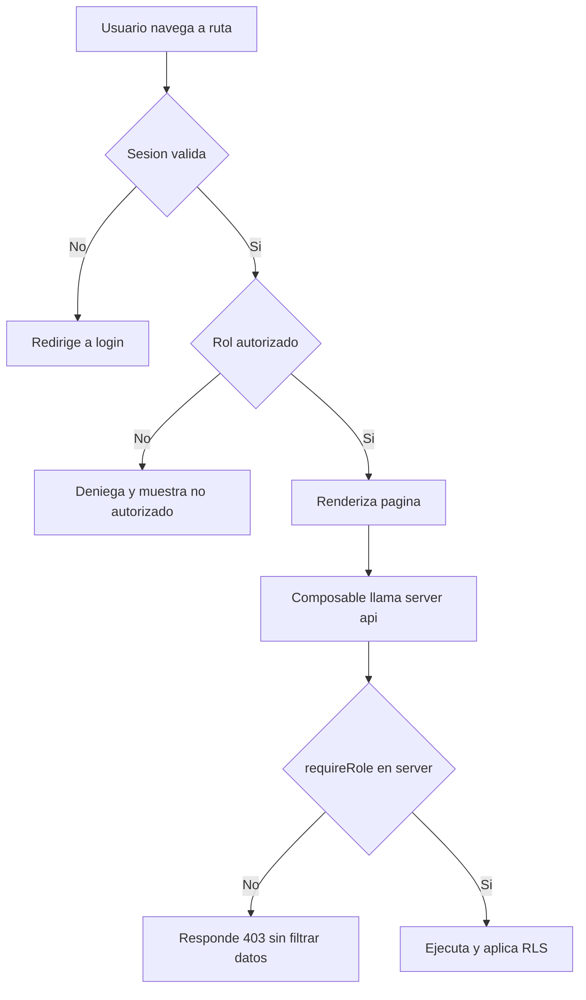

# Design Document

## Overview
**Purpose**: `platform-foundation` entrega la base técnica y de seguridad de un SaaS multiempresa para eventos musicales: una aplicación Nuxt 4 inicializada, autenticación de usuarios, aislamiento estricto de datos por empresa, control de acceso por roles resuelto del lado servidor, y las pantallas de Login y shell del Dashboard.

**Users**: Operadores de la plataforma (SUPER_ADMIN) y usuarios de cada empresa (COMPANY_ADMIN, EVENT_MANAGER, GATE_STAFF) que accederán al panel administrativo. Las especificaciones `event-management` y `ticketing-checkin` consumirán esta base.

**Impact**: Crea el proyecto desde cero. Establece el esquema multi-tenant, las políticas RLS, el hook de claims, las guardas server-side y los contratos compartidos (tipos e identidad) que todo el resto del sistema reutiliza.

### Goals
- Aislamiento de datos por empresa a nivel de base de datos (RLS), independiente de la lógica del cliente.
- Autenticación e identidad de usuario (empresa + rol) confiables y resueltas server-side.
- RBAC con 4 roles y un contrato de identidad reutilizable por specs aguas abajo.
- Pantallas mínimas de Login y shell del Dashboard con navegación por rol.

### Non-Goals
- CRUD de eventos y etapas de boletería (lo cubre `event-management`).
- Registro público, tickets, QR, PDF y check-in (lo cubre `ticketing-checkin`).
- Pagos, facturación, notificaciones, reportería, alta self-service de empresas/usuarios (gestión de altas fuera de alcance; se asume provisión inicial vía Supabase/seed).

## Boundary Commitments

### This Spec Owns
- Inicialización del proyecto Nuxt 4 (estructura, Tailwind, configuración del módulo Supabase).
- Esquema de datos de identidad/tenancy: `companies`, `profiles`, enum `app_role`.
- Custom Access Token Hook que inyecta `company_id` y `role` en `app_metadata`.
- Funciones helper de RLS (`auth_company_id`, `auth_role`, `is_super_admin`) y el patrón de políticas multi-tenant que las tablas aguas abajo reutilizarán.
- Capa server-side de autenticación/autorización: helpers `requireUser` / `requireRole` y middleware de rutas.
- Contrato de identidad compartido (`AuthContext`, tipos de rol y sesión) y los tipos base del dominio.
- Pantalla de Login, layout autenticado del Dashboard y navegación filtrada por rol.

### Out of Boundary
- Definición de entidades de negocio (eventos, tiers, asistentes, tickets, check-ins).
- Pantallas de negocio más allá de Login y el shell del Dashboard.
- El esquema concreto de tablas de otros dominios (esas tablas reutilizan el patrón RLS definido aquí, pero las define cada spec dueña).

### Allowed Dependencies
- Supabase (Auth, PostgreSQL, Storage) como servicio externo.
- `@nuxtjs/supabase` v2.x (utilidades server-side `serverSupabaseUser` / `serverSupabaseClient` / `serverSupabaseServiceRole`).
- Nuxt 4 / Vue 3 / TypeScript / Tailwind CSS.
- Esta base NO depende de ningún spec (es la raíz del grafo de dependencias).

### Revalidation Triggers
Cambios que obligan a `event-management` y `ticketing-checkin` a re-verificar su integración:
- Cambios en el contrato `AuthContext` (forma de identidad/empresa/rol).
- Cambios en el patrón de políticas RLS o en las firmas de `auth_company_id` / `auth_role` / `is_super_admin`.
- Cambios en los claims inyectados por el Custom Access Token Hook (`app_metadata`).
- Cambios en los helpers `requireUser` / `requireRole` o en el comportamiento del middleware.
- Cambios en el conjunto de roles del enum `app_role`.

## Architecture

### Architecture Pattern & Boundary Map
Patrón seleccionado: **arquitectura en capas con dirección de dependencias estricta**, defensa en profundidad de seguridad (RLS en DB + guardas en server routes + guardas de UI para UX). La lógica crítica vive en `server/`; los componentes Vue consumen servicios únicamente vía composables.



**Architecture Integration**:
- Selected pattern: capas (Types → Config → DB/RLS → Server utils → Server API → Composables → UI) con seguridad en profundidad.
- Domain/feature boundaries: identidad y tenancy aquí; entidades de negocio en specs aguas abajo, reutilizando el patrón RLS.
- New components rationale: el Custom Access Token Hook y los helpers RLS son necesarios para que el aislamiento no dependa del cliente; los helpers server-side centralizan la autorización.

### Dependency Direction
`types` → `supabase config/client` → `DB (RLS, hook)` → `server/utils (auth)` → `server/api` → `composables` → `pages/components`. Cada capa importa solo de capas a su izquierda; nunca hacia arriba. Las violaciones se tratan como errores en revisión.

### Technology Stack

| Layer | Choice / Version | Role in Feature | Notes |
|-------|------------------|-----------------|-------|
| Frontend | Nuxt 4 + Vue 3 + Tailwind CSS | Pages, layouts, composables, middleware de ruta | `app/` como srcDir (Nuxt 4) |
| Backend / Services | Nuxt server routes (`server/api`), `@nuxtjs/supabase` 2.x | Auth/autorización server-side, lógica crítica | `serverSupabaseUser` para identidad |
| Data / Storage | Supabase PostgreSQL (RLS), Supabase Auth, Supabase Storage | Identidad, tenancy, sesiones | RLS forzado en todas las tablas |
| Lenguaje | TypeScript (modo estricto) | Tipos e interfaces en toda la app | Prohibido `any` |

## File Structure Plan

### Directory Structure
```
vita_felix/
├── nuxt.config.ts                      # Config Nuxt + módulo @nuxtjs/supabase + Tailwind
├── app.config.ts                       # Navegación por rol (config declarativa)
├── package.json
├── .env.example                        # Variables Supabase (url, publishable key, service role)
├── app/
│   ├── assets/css/tailwind.css
│   ├── types/
│   │   ├── auth.ts                      # AppRole, AuthContext, SessionUser
│   │   └── database.ts                  # Tipos generados/derivados del esquema
│   ├── composables/
│   │   ├── useAuth.ts                   # Login/logout/estado de sesión (consume server api)
│   │   └── useAuthorization.ts          # Helpers de UI: can(role), navegación visible
│   ├── middleware/
│   │   ├── auth.global.ts               # Redirige a /login si no hay sesión
│   │   └── role.ts                      # Guarda por rol para rutas protegidas
│   ├── layouts/
│   │   ├── default.vue                  # Shell autenticado (header, nav, logout)
│   │   └── auth.vue                     # Layout simple para login
│   ├── pages/
│   │   ├── login.vue                    # Pantalla de inicio de sesión
│   │   ├── confirm.vue                  # Callback PKCE de Supabase
│   │   └── index.vue                    # Dashboard (home autenticado)
│   └── components/
│       ├── AppNav.vue                   # Navegación filtrada por rol
│       └── ui/                          # Botones, inputs, campos (presentacional)
├── server/
│   ├── api/
│   │   ├── auth/session.get.ts          # Devuelve AuthContext del usuario actual
│   │   └── auth/logout.post.ts          # Cierra sesión server-side
│   ├── middleware/
│   │   └── auth-context.ts              # Adjunta AuthContext a event.context
│   └── utils/
│       ├── supabase.ts                  # Acceso a service role (encapsulado, server-only)
│       └── auth.ts                      # requireUser, requireRole, getAuthContext
└── supabase/
    └── migrations/
        ├── 0001_init_tenancy.sql        # companies, profiles, enum app_role, índices
        ├── 0002_rls_helpers.sql         # auth_company_id, auth_role, is_super_admin
        ├── 0003_rls_policies.sql        # Políticas RLS de companies y profiles
        ├── 0004_access_token_hook.sql   # Custom Access Token Hook (claims)
        └── 0005_seed.sql                # Datos mínimos (empresa + super admin) opcional
```

### Modified Files
- N/A (proyecto greenfield; todos los archivos son nuevos).

## System Flows

### Inicio de sesión y emisión de claims


### Acceso a ruta protegida


## Requirements Traceability

| Requirement | Summary | Components | Interfaces | Flows |
|-------------|---------|------------|------------|-------|
| 1.1, 1.2, 1.3 | Aislamiento por empresa en lectura/escritura, no depende del cliente | RLS policies, helpers RLS | `auth_company_id()`, políticas SELECT/INSERT/UPDATE/DELETE | — |
| 1.4 | SUPER_ADMIN transversal | RLS policies, `is_super_admin` | cláusula de rol en políticas | — |
| 1.5 | Sin identidad válida no hay datos | RLS (`to authenticated`), `requireUser` | políticas `to authenticated` | Acceso a ruta protegida |
| 2.1, 2.2, 2.3 | Login/logout y errores | useAuth, login.vue, `auth/logout` | `AuthService` | Inicio de sesión |
| 2.4, 2.5, 2.6 | Protección de rutas, persistencia y expiración | `auth.global.ts`, `@nuxtjs/supabase` SSR cookies | middleware | Acceso a ruta protegida |
| 3.1, 3.6 | 4 roles y contrato de identidad reutilizable | enum `app_role`, `AuthContext`, `auth/session` | `AuthContext` | Inicio de sesión |
| 3.2, 3.3, 3.4, 3.5 | Autorización server-side por rol | `requireRole`, `auth-context` middleware, RLS | `requireRole(roles)` | Acceso a ruta protegida |
| 4.1, 4.2, 4.3 | Membresía usuario↔empresa↔rol | `profiles`, hook de claims | esquema `profiles` | Inicio de sesión |
| 4.4 | Cuenta no habilitada | `getAuthContext`, layout | `AuthContext.status` | Acceso a ruta protegida |
| 5.1, 5.2, 5.3, 5.4 | Pantalla de login | login.vue, useAuth | `AuthService.signIn` | Inicio de sesión |
| 6.1, 6.2, 6.3, 6.4 | Shell del dashboard y navegación por rol | default.vue, AppNav, role.ts, app.config | `useAuthorization` | Acceso a ruta protegida |
| 7.1, 7.2, 7.3, 7.4 | NFR de seguridad | RLS, server utils auth, service role encapsulado | `requireUser`/`requireRole` | Ambos flujos |

## Components and Interfaces

| Component | Domain/Layer | Intent | Req Coverage | Key Dependencies | Contracts |
|-----------|--------------|--------|--------------|------------------|-----------|
| Esquema de tenancy | Data | Tablas e identidad multi-tenant | 1, 4 | Supabase Postgres (P0) | State |
| Helpers y políticas RLS | Data | Aislamiento por empresa a nivel DB | 1, 7 | esquema tenancy (P0) | State |
| Custom Access Token Hook | Data | Inyecta company_id y role en JWT | 3, 4 | profiles (P0) | State |
| `server/utils/auth` | Backend | Identidad y autorización server-side | 2, 3, 7 | @nuxtjs/supabase (P0) | Service |
| `server/api/auth` | Backend | Sesión y logout server-side | 2, 3 | server/utils/auth (P0) | API |
| useAuth / useAuthorization | Frontend | Estado de sesión y permisos de UI | 2, 5, 6 | server/api (P0) | Service |
| Login + Dashboard shell | Frontend/UI | Pantallas mínimas y navegación por rol | 5, 6 | composables (P0) | — |

### Data — Esquema de tenancy

#### companies / profiles / app_role

| Field | Detail |
|-------|--------|
| Intent | Fuente de verdad de empresas, usuarios y su rol |
| Requirements | 1.1, 4.1, 4.2, 4.3 |

**Responsibilities & Constraints**
- `companies` es el aggregate root del tenant. `profiles` vincula `auth.users` ↔ `companies` ↔ `app_role`.
- Invariante: todo usuario no SUPER_ADMIN tiene `company_id` y `role`; SUPER_ADMIN puede tener `company_id` nulo.
- `app_role` es un enum cerrado con exactamente cuatro valores.

**Contracts**: State [x]

##### State Management
- State model: ver Data Models (Physical Data Model).
- Persistence & consistency: Postgres; integridad referencial `profiles.company_id → companies.id`; `profiles.id → auth.users.id` (cascade on delete).
- Concurrency strategy: no aplica (escrituras de identidad infrecuentes; provisión administrativa).

### Data — Helpers y políticas RLS

#### Helpers RLS + patrón de políticas

| Field | Detail |
|-------|--------|
| Intent | Proveer aislamiento por empresa reutilizable y eficiente |
| Requirements | 1.1, 1.2, 1.3, 1.4, 1.5, 7.1, 7.2 |

**Responsibilities & Constraints**
- Funciones `auth_company_id()`, `auth_role()`, `is_super_admin()` leen del JWT y se invocan envueltas en `(select ...)` para cachear vía InitPlan.
- Patrón de política por tabla aislada: SELECT/UPDATE/DELETE con `USING`, INSERT/UPDATE con `WITH CHECK`, ambos comparando `company_id` contra `auth_company_id()` o permitiendo a SUPER_ADMIN.
- RLS habilitado y forzado (`force row level security`) en todas las tablas con `company_id`.

**Contracts**: State [x]

##### State Management
- State model: políticas declarativas en Postgres.
- Consistency: el aislamiento se evalúa antes de devolver cualquier fila; no depende de la app.
- Concurrency: N/A.

### Data — Custom Access Token Hook

| Field | Detail |
|-------|--------|
| Intent | Inyectar `company_id` y `role` en `app_metadata` del JWT |
| Requirements | 3.1, 3.6, 4.3 |

**Responsibilities & Constraints**
- Función Postgres invocada por Supabase Auth antes de emitir el JWT; lee `profiles` del usuario y añade claims a `app_metadata` (nunca a `user_metadata`).
- Si el usuario no tiene perfil habilitado, no inyecta `company_id`/`role` (consumido por 4.4).

**Contracts**: State [x]

### Backend — server/utils/auth

| Field | Detail |
|-------|--------|
| Intent | Centralizar identidad y autorización server-side |
| Requirements | 2.4, 3.2, 3.3, 3.4, 3.5, 7.1, 7.2, 7.3 |

**Responsibilities & Constraints**
- `getAuthContext` deriva `AuthContext` desde `serverSupabaseUser` (identidad validada server-side).
- `requireUser` lanza 401 si no hay sesión; `requireRole(roles)` lanza 403 si el rol no está permitido, sin filtrar datos sensibles en el error.
- El acceso al service role queda encapsulado en `server/utils/supabase.ts` y nunca se expone al cliente.

**Contracts**: Service [x]

##### Service Interface
```typescript
type AppRole = 'SUPER_ADMIN' | 'COMPANY_ADMIN' | 'EVENT_MANAGER' | 'GATE_STAFF';

interface AuthContext {
  userId: string;
  email: string;
  companyId: string | null;   // null solo para SUPER_ADMIN
  role: AppRole;
  status: 'active' | 'disabled'; // 'disabled' = sin perfil/rol habilitado
}

interface AuthGuards {
  getAuthContext(event: H3Event): Promise<AuthContext | null>;
  requireUser(event: H3Event): Promise<AuthContext>;            // 401 si no hay sesión
  requireRole(event: H3Event, roles: AppRole[]): Promise<AuthContext>; // 403 si rol no permitido
}
```
- Preconditions: la request transita por el módulo Supabase (cookies SSR disponibles).
- Postconditions: devuelve un `AuthContext` confiable o lanza un error tipado (401/403).
- Invariants: la autorización nunca confía en valores enviados por el cliente.

**Implementation Notes**
- Integration: usado por `server/api/auth` y por todos los server routes de specs aguas abajo.
- Validation: errores con `createError({ statusCode, statusMessage })` sin exponer datos sensibles ni IDs internos.
- Risks: divergencia de guardas si se reimplementan; mitigado centralizando aquí.

### Backend — server/api/auth

| Field | Detail |
|-------|--------|
| Intent | Exponer sesión actual y cierre de sesión |
| Requirements | 2.1, 2.3, 3.6 |

**Contracts**: API [x]

##### API Contract
| Method | Endpoint | Request | Response | Errors |
|--------|----------|---------|----------|--------|
| GET | /api/auth/session | — | `AuthContext` | 401 |
| POST | /api/auth/logout | — | `{ ok: true }` | 401 |

### Frontend — Composables y UI

#### useAuth / useAuthorization / Login / Dashboard shell

| Field | Detail |
|-------|--------|
| Intent | Estado de sesión, permisos de UI y pantallas mínimas |
| Requirements | 2.2, 2.5, 5.1, 5.2, 5.3, 5.4, 6.1, 6.2, 6.3, 6.4 |

**Responsibilities & Constraints**
- `useAuth`: expone `signIn`, `signOut`, `session`/`user`; delega validación a Supabase y `server/api/auth`.
- `useAuthorization`: helper `can(roles)` y lista de navegación visible según rol (lee `app.config`).
- Componentes presentacionales no contienen lógica de negocio crítica; consumen composables.

**Contracts**: Service [x] (composables)

**Implementation Notes**
- Integration: `login.vue` usa `useAuth`; `default.vue`/`AppNav` usan `useAuthorization`.
- Validation: validación de formulario (campos requeridos/formato) en `login.vue`; estado de carga evita envíos duplicados (5.3).
- Risks: las guardas de UI son solo UX; la seguridad real está en server + RLS (7.2).

## Data Models

### Domain Model
- **Aggregate `Company`**: raíz del tenant; posee membresías (`profiles`).
- **Entity `Profile`**: identidad de aplicación de un usuario de `auth.users`, con `company_id` y `role`.
- **Value/Enum `AppRole`**: { SUPER_ADMIN, COMPANY_ADMIN, EVENT_MANAGER, GATE_STAFF }.
- Invariantes: un `profile` no SUPER_ADMIN siempre referencia una `company`; el enum es cerrado.

### Physical Data Model (PostgreSQL)
```sql
create type app_role as enum ('SUPER_ADMIN','COMPANY_ADMIN','EVENT_MANAGER','GATE_STAFF');

create table companies (
  id          uuid primary key default gen_random_uuid(),
  name        text not null,
  slug        text not null unique,
  created_at  timestamptz not null default now()
);

create table profiles (
  id          uuid primary key references auth.users(id) on delete cascade,
  company_id  uuid references companies(id) on delete restrict,
  role        app_role not null,
  full_name   text,
  created_at  timestamptz not null default now()
);

-- Índice compuesto con company_id como columna líder (rendimiento RLS)
create index profiles_company_id_idx on profiles (company_id, id);
```
- Integridad: `profiles.id` 1:1 con `auth.users`; `profiles.company_id` FK a `companies`.
- RLS: habilitado y forzado en `companies` y `profiles`. Helpers `auth_company_id()`/`auth_role()`/`is_super_admin()` envueltos en `select` en las políticas.

### Data Contracts & Integration
- `AuthContext` (ver Service Interface) es el contrato de identidad consumido por specs aguas abajo. Serialización JSON.
- Claims JWT (`app_metadata`): `{ company_id: uuid | null, role: app_role }`.

## Error Handling

### Error Strategy
- **User Errors (4xx)**: credenciales inválidas → mensaje genérico sin revelar causa (2.2); falta de sesión → 401 y redirección a login; rol no permitido → 403 sin filtrar datos (3.3, 7.3).
- **System Errors (5xx)**: fallos de Supabase → mensaje de error controlado y registro server-side; degradación a estado no autenticado ante sesión inválida/expirada (2.6).
- **Business Logic (422/403)**: cuenta sin perfil/rol habilitado → bloqueo de acceso y mensaje "cuenta no habilitada" (4.4).

### Monitoring
- Registro server-side de denegaciones de autorización (sin datos sensibles) para auditoría básica.

## Testing Strategy

### Unit Tests
- `requireRole` concede/deniega según rol (matriz de los 4 roles) — cubre 3.3, 3.4.
- `getAuthContext` deriva `status: 'disabled'` cuando falta perfil/rol — cubre 4.4.
- `useAuthorization.can()` filtra navegación por rol — cubre 6.2.

### Integration Tests
- Políticas RLS: un usuario de empresa A no lee ni escribe filas de empresa B; SUPER_ADMIN sí — cubre 1.1–1.4.
- `GET /api/auth/session` devuelve `AuthContext` correcto tras login y 401 sin sesión — cubre 2.1, 1.5.
- Custom Access Token Hook inyecta `company_id`/`role` en `app_metadata` — cubre 3.1, 4.3.

### E2E / UI Tests
- Login con credenciales válidas → Dashboard; inválidas → error genérico — cubre 2.1, 2.2, 5.x.
- Acceso directo por URL a sección no permitida para el rol → bloqueo — cubre 6.3.
- Usuario autenticado en `/login` → redirección al Dashboard — cubre 5.4.

## Security Considerations
- Autorización 100% server-side (`requireUser`/`requireRole`); las guardas de UI son solo UX (7.2).
- Aislamiento defensivo en profundidad: RLS en DB + guardas en server routes.
- `app_metadata` (server-only) para claims de autorización; nunca `user_metadata`.
- Service role encapsulado en `server/utils`, jamás en el cliente; clave en variables de entorno server-only.
- Mensajes de error sin filtrar credenciales ni IDs internos; sin datos sensibles en la URL (7.4).
