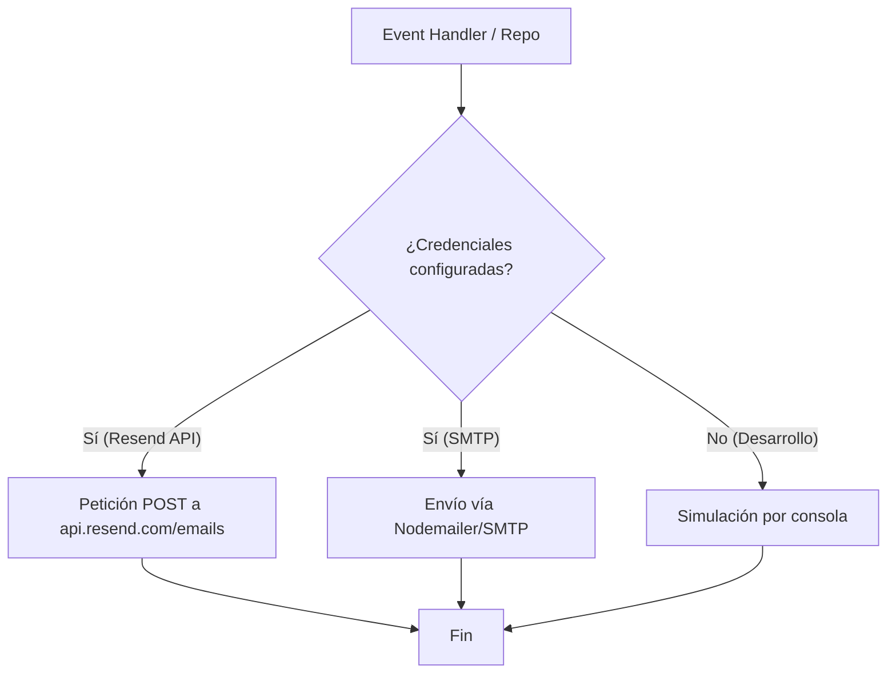
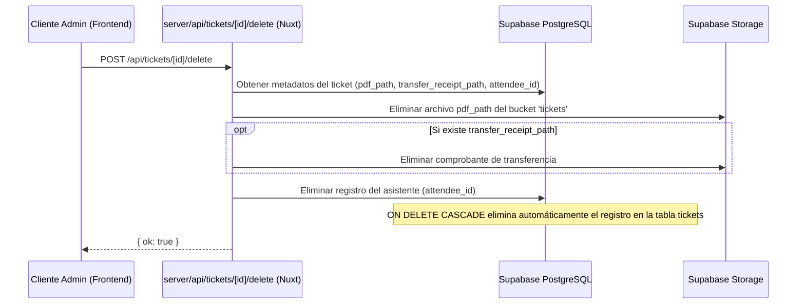

# Diseño Técnico: Envío de Correos y Acciones de Tickets

Este documento describe la arquitectura y el diseño técnico propuesto para implementar la integración de correo electrónico, corregir la anulación del conteo en analíticas y permitir la eliminación física de asistentes.

## Arquitectura del Servicio de Correo

El servicio de correo se implementará como un módulo utilitario server-side en `server/utils/email.ts`. Este módulo será stateless y se integrará con las variables de entorno configuradas.

### Modelo de Envío


### Contrato de la Utilidad de Correo
```typescript
interface SendEmailOptions {
  to: string
  subject: string
  html: string
  attachments?: Array<{
    filename: string
    content: Buffer
    contentType: string
  }>
}

export async function sendEmail(options: SendEmailOptions): Promise<boolean>
```

---

## Diseño del Endpoint de Eliminación Permanente

La eliminación física requiere un tratamiento especial para mantener la integridad de la base de datos y evitar archivos huérfanos en Supabase Storage.

### Secuencia de Eliminación


---

## Modelo de Datos y Modificaciones en Consultas Analíticas

### Corrección en `dashboard.get.ts`

1. **Ingresos Estimados**:
   - Anterior: Sumaba el precio de todos los tiers de tickets asociados al evento.
   - Nuevo: Excluirá tickets con `status = 'void'`.
   ```sql
   select t.id, tt.price from public.tickets t
   join public.ticket_tiers tt on tt.id = t.tier_id
   where t.event_id = :eventId and t.status != 'void';
   ```

2. **Tickets Emitidos**:
   - Anterior: Cuenta del total de tickets en la base de datos.
   - Nuevo: Excluirá los tickets en estado `'void'`.

3. **Ventas por Etapa**:
   - Anterior: Conteo total agrupado por tier.
   - Nuevo: Excluirá tickets anulados en el conteo agrupado por tier.
