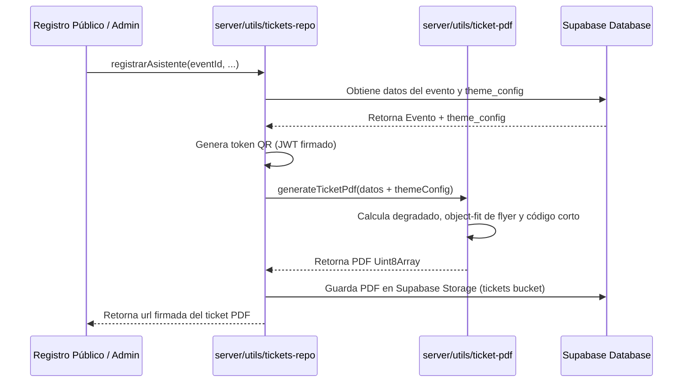

# Documento de Diseño

## Resumen
Esta especificación detalla la arquitectura y el diseño técnico para el rediseño premium y corporativo de la plantilla de ticket PDF de Vita Felix. La solución introduce soporte para personalización dinámica (branding/colores) por evento, tarjetas independientes limpias, degradados de fondo dinámicos y códigos cortos legibles para mejorar la experiencia de usuario móvil.

### Objetivos
- Dotar al ticket de un aspecto visual premium (estilo SaaS oscuro con tarjetas blancas y bordes redondeados).
- Hacer el diseño 100% programable a través de variables de tema por evento (colores, degradados, logotipos).
- Reemplazar la visualización del UUID largo por un código corto `VF-XXXXXXX` sin perder la trazabilidad de validación.
- Garantizar que el ticket sea legible en pantallas móviles y fácil de compartir en redes sociales.

### No Objetivos
- Rediseñar el panel de administración de eventos en esta fase (se asume que los campos se seedearán o configurarán mediante API).
- Alterar la lógica criptográfica de firma o validación del token QR.

---

## Compromisos de Límites

### Este Spec Propietario de:
- El esquema del objeto de tema en la base de datos (`events.theme_config`).
- El mapeo y flujo de datos de tema desde el repositorio de eventos hasta el generador de PDF.
- El algoritmo de interpolación y dibujo de degradados lineales en `pdf-lib`.
- La lógica de derivación determinista del código corto del ticket.
- La maquetación y posicionamiento final de los elementos visuales del ticket en el canvas de PDF.

### Fuera de Límite:
- El control de acceso basado en roles para la edición del tema.
- El almacenamiento y alojamiento de imágenes en Supabase Storage (se asume que se suministran URLs públicas válidas).

---

## Arquitectura

La personalización visual requiere extender la base de datos de eventos para soportar configuraciones de estilo. El flujo de generación del ticket consumirá esta configuración desde el evento asociado y adaptará el renderizado dinámicamente en el servidor de Nuxt.

### Mapa de Componentes y Datos


### Tabla de Tecnologías
| Capa | Elección | Rol |
| :--- | :--- | :--- |
| Almacenamiento | Supabase PostgreSQL | Columna `theme_config` JSONB en tabla `events` |
| Motor de PDF | `pdf-lib` | Generación y dibujo primitivo del canvas de PDF |
| Generación QR | `qrcode` | Conversión del token firmado a PNG |

---

## Plan de Estructura de Archivos

### Archivos Nuevos
- `supabase/migrations/0016_event_theme_config.sql` — Migración SQL para añadir la columna de tema a la tabla `events`.

### Archivos Modificados
- [events.ts](file:///Users/juandresbo/_Developer/vita_felix/app/types/events.ts) — Inclusión del tipo `EventThemeConfig` y actualización de la interfaz `Event` y derivados.
- [events-repo.ts](file:///Users/juandresbo/_Developer/vita_felix/server/utils/events-repo.ts) — Lectura y escritura del campo `theme_config` desde y hacia la base de datos.
- [ticket-pdf.ts](file:///Users/juandresbo/_Developer/vita_felix/server/utils/ticket-pdf.ts) — Rediseño completo de la maquetación del PDF usando variables del tema, interpolación de degradado y derivación del código corto.
- [tickets-repo.ts](file:///Users/juandresbo/_Developer/vita_felix/server/utils/tickets-repo.ts) — Modificación de la query del evento para incluir `theme_config` y pasarlo a la función generadora del PDF.
- [ticket-pdf.spec.ts](file:///Users/juandresbo/_Developer/vita_felix/server/utils/ticket-pdf.spec.ts) — Adaptación de las pruebas unitarias para validar el nuevo esquema de parámetros y verificar la robustez con y sin variables de tema.

---

## Componentes e Interfaces

### Tipos de Configuración de Tema
En [events.ts](file:///Users/juandresbo/_Developer/vita_felix/app/types/events.ts):
```typescript
export interface EventThemeConfig {
  primaryColor?: string         // Hexadecimal (ej: '#7C3AED')
  secondaryColor?: string       // Hexadecimal (ej: '#10B981')
  gradientStart?: string        // Color de inicio del hero (ej: '#0F172A')
  gradientEnd?: string          // Color de fin del hero (ej: '#1E1B4B')
  logoUrl?: string | null       // URL del logotipo personalizado para el pie
}
```

### Interfaz del Generador PDF
En [ticket-pdf.ts](file:///Users/juandresbo/_Developer/vita_felix/server/utils/ticket-pdf.ts):
```typescript
export interface TicketPdfData {
  qrToken: string
  eventName: string
  venue: string
  eventAt: string
  tierName: string
  attendeeName: string
  ticketId: string
  flyerUrl?: string | null
  themeConfig?: EventThemeConfig | null
}
```

#### Detalles de Implementación en `ticket-pdf.ts`:

1. **Interpolación del Degradado del Hero**:
   PDF no soporta degradados de forma nativa sin manipulación de diccionarios internos de bajo nivel. Implementaremos una solución de renderizado interpolado por líneas:
   - Dividir la altura del hero (200 px, de `y = 490` a `y = 690`) en 200 bandas horizontales de 1 px de grosor.
   - Para cada paso, calcular el factor de interpolación $t \in [0, 1]$.
   - Interpolar linealmente los canales R, G, y B entre `gradientStart` y `gradientEnd`.
   - Dibujar la línea horizontal correspondiente con el color calculado.

2. **Corte y Proporción del Flyer (Object-fit: Contain)**:
   - Medir el ancho (`imgW`) y alto (`imgH`) de la imagen incrustada.
   - Calcular la escala: `scale = Math.min(380 / imgW, 200 / imgH)`.
   - Dimensionar la imagen a `scaledW = imgW * scale` y `scaledH = imgH * scale`.
   - Centrar dentro del rectángulo hero de `380x200` aplicando un desfase de posición.
   - Para aplicar bordes redondeados, se dibujará un marco con esquinas redondeadas sobrepuesto o se utilizarán operadores de clipping en PDF:
     ```typescript
     // Operadores de clipping para esquinas redondeadas en pdf-lib
     page.pushOperators(
       // M x+r y
       // L x+w-r y
       // ... dibujar curva bezier ...
       // W (clip)
       // n (cerrar ruta sin trazo)
     )
     // ... page.drawImage(...) ...
     ```

3. **Código Corto del Ticket**:
   - Derivar el código corto de manera determinista desde el `ticketId` (UUID):
     ```typescript
     export function getShortCode(ticketId: string): string {
       const clean = ticketId.replace(/-/g, '').toUpperCase();
       return `VF-${clean.slice(0, 7)}`;
     }
     ```
   - Este código reemplazará visualmente al UUID largo en la base inferior del ticket.

---

## Modelo de Datos

### Cambios en Base de Datos (`events`)
La migración creará el campo JSONB en la tabla `events`:
```sql
ALTER TABLE public.events ADD COLUMN theme_config JSONB DEFAULT '{}'::jsonb;
```

---

## Manejo de Errores

### Descarga del Flyer o Logo
- Si la URL del flyer o el logo falla (error 404, de red, etc.), el sistema de generación de PDF debe interceptar el error silenciosamente (try-catch) y proceder usando la cabecera por defecto y colores predeterminados (sin logo secundario).

### Colores de Tema Inválidos
- Si los colores del tema provistos no son válidos (no son hexágonos correctos), el sistema utilizará colores por defecto seguros:
  - `primaryColor`: violeta (`#7C3AED`, RGB: `0.49, 0.18, 0.90`)
  - `gradientStart`: azul pizarra (`#0F172A`, RGB: `0.06, 0.09, 0.16`)
  - `gradientEnd`: violeta muy oscuro (`#1E1B4B`, RGB: `0.12, 0.11, 0.29`)

---

## Estrategia de Pruebas

### Pruebas Unitarias (`ticket-pdf.spec.ts`)
- **Caso 1**: Generación exitosa con parámetros por defecto (valores omitidos o vacíos).
- **Caso 2**: Generación con objeto de configuración de tema válido completo (degradados personalizados, colores del badge y logos).
- **Caso 3**: Validación de la derivación correcta del código corto (formato `VF-[A-Z0-9]{7}`).
- **Caso 4**: Tolerancia a fallos ante URLs de logo o flyer corruptas o caídas.
