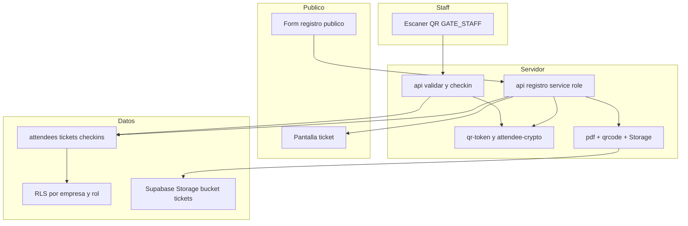
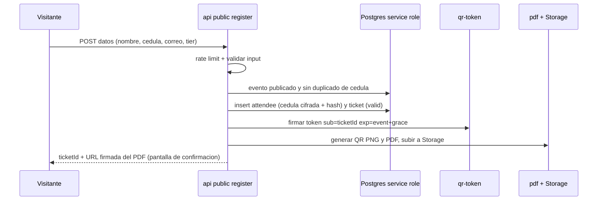
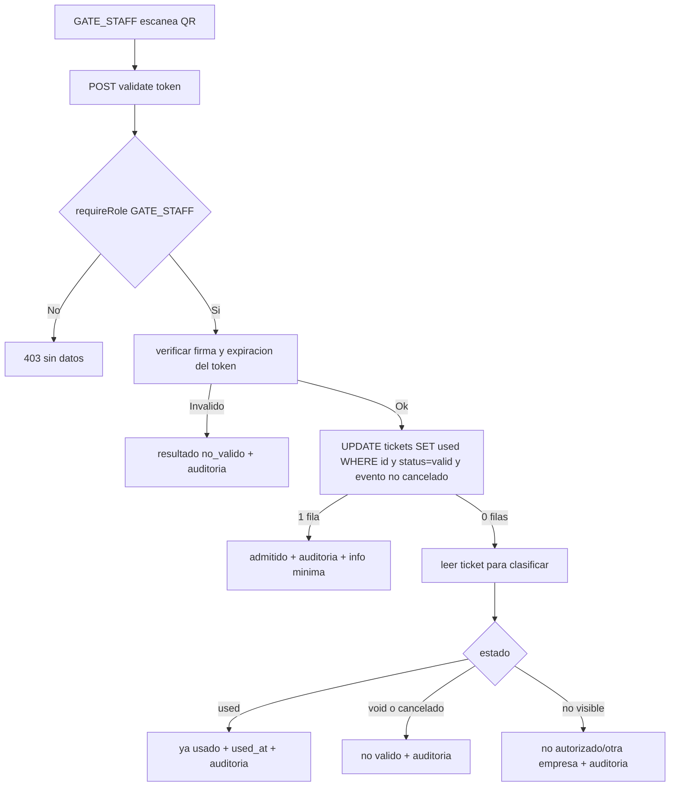

# Design Document

## Overview
**Purpose**: `ticketing-checkin` entrega el ciclo de vida completo del ticket: registro público de asistentes a un evento publicado, emisión de un ticket con un QR firmado e infalsificable entregado en PDF, y validación en puerta por GATE_STAFF con un check-in atómico que impide el doble ingreso.

**Users**: el público (registro, sin sesión), GATE_STAFF (escaneo y validación), y el staff de gestión/operador para consultar tickets/asistentes de su empresa. Consume `events`/`ticket_tiers` de `event-management` y la identidad/RBAC/RLS de `platform-foundation`.

**Impact**: añade tres tablas (`attendees`, `tickets`, `checkins`), un enum de estado de ticket, módulos server de criptografía (token QR, cifrado de cédula), generación de PDF/QR, almacenamiento en Storage, endpoints públicos y autenticados, y pantallas (registro público, confirmación con ticket, escáner). No modifica los contratos upstream.

### Goals
- Registro público seguro (sin sesión) que emite un ticket con QR firmado.
- QR infalsificable (JWT HMAC con expiración) que referencia el ticket por id opaco, sin cédula.
- Cédula protegida (cifrado app-level + hash para dedup), nunca en QR/PDF/respuestas públicas.
- Check-in atómico (exactamente un uso bajo concurrencia) con auditoría.

### Non-Goals
- Pagos/cobro, facturación, notificaciones, reventa/transferencia, reportería.
- Control de cupo en el registro (se emite sin validar quota en esta versión).
- CRUD de eventos/tiers (`event-management`) y auth/RBAC base (`platform-foundation`).

## Boundary Commitments

### This Spec Owns
- Esquema `public.attendees`, `public.tickets`, `public.checkins` y el enum `public.ticket_status`.
- Políticas RLS de esas tablas (aislamiento por empresa + rol), reutilizando los helpers de la foundation.
- Módulo de token QR (`qr-token`: sign/verify HMAC) y de cifrado de cédula (`attendee-crypto`).
- Generación server-side de QR + PDF y su almacenamiento en Storage (bucket `tickets`).
- Endpoints: registro público, descarga/URL del ticket, validación + check-in atómico.
- Pantallas: formulario público de registro, confirmación con ticket, escáner de QR (GATE_STAFF).

### Out of Boundary
- Definición de `events`/`ticket_tiers` (las consume, no las define).
- Helpers de claims/RLS de la foundation, `AuthContext`, roles (los reutiliza).
- Lógica de cupo, pagos, notificaciones.

### Allowed Dependencies
- `platform-foundation`: RLS helpers, `requireUser`/`requireRole`, `AuthContext`, rol GATE_STAFF, `serviceRoleClient`/`userClient`.
- `event-management`: tablas `events` (estado `published`) y `ticket_tiers`.
- Supabase (Auth, PostgreSQL, **Storage**), `@nuxtjs/supabase` 2.x, Nuxt 4 / Vue 3 / TS / Tailwind.
- Nuevas libs: `qrcode` (QR PNG), `pdf-lib` (PDF). Criptografía con `node:crypto` (sin lib externa).

### Revalidation Triggers
- Cambios en el esquema de `events`/`ticket_tiers` o en qué estado se considera "abierto al registro" (hoy `published`).
- Cambios en el contrato `AuthContext`, helpers RLS o el rol GATE_STAFF.
- Cambios en el formato del token QR (romperían los PDFs ya emitidos).

## Architecture

### Architecture Pattern & Boundary Map
Capas con dirección de dependencias estricta + defensa en profundidad. Criptografía y atomicidad en `server/`; los componentes Vue consumen vía composables. El registro público usa service role (anon no pasa RLS); el check-in usa el cliente de usuario (RLS por empresa).



### Dependency Direction
`types/ticketing` → `server/utils (qr-token, attendee-crypto)` → `DB (tablas, RLS)` → `server/utils (tickets-repo, pdf)` → `server/api` → `composables` → `pages`. Reutiliza `~/types/auth`, `server/utils/auth`, `server/utils/supabase` (capas base a la izquierda).

### Technology Stack

| Layer | Choice / Version | Role in Feature | Notes |
|-------|------------------|-----------------|-------|
| Frontend | Nuxt 4 + Vue 3 + Tailwind | Registro público, ticket, escáner | Escáner usa la cámara (getUserMedia) + decodificación QR |
| Backend | Nuxt server routes, `@nuxtjs/supabase` 2.x | Registro, emisión, validación/check-in | service role (público) y user client (staff) |
| Cripto | `node:crypto` | HMAC (JWT QR), AES-256-GCM (cédula) | Módulos puros y testeables |
| PDF/QR | `pdf-lib@1.17.1`, `qrcode@1.5.4` | Generación server-side | JS puro, compatible con Nitro |
| Data | Supabase PostgreSQL (RLS) + Storage | Tablas + bucket `tickets` privado | UPDATE condicional atómico |
| Lenguaje | TypeScript estricto | Tipos e interfaces; prohibido `any` | — |

## File Structure Plan

### Directory Structure
```
vita_felix/
├── app/
│   ├── types/
│   │   └── ticketing.ts                       # TicketStatus, Attendee, Ticket, Checkin, payloads, resultados de validación
│   ├── composables/
│   │   ├── useRegistration.ts                  # registro público (POST) + obtención del ticket
│   │   └── useCheckin.ts                        # envío del token al endpoint de validación
│   ├── pages/
│   │   ├── e/
│   │   │   └── [eventId]/
│   │   │       └── register.vue                # Formulario público de registro (layout público)
│   │   ├── t/
│   │   │   └── [ticketId].vue                   # Confirmación / ticket (acceso por URL firmada del PDF)
│   │   └── scan.vue                             # Escáner QR (GATE_STAFF; requiredRoles)
│   └── components/
│       └── ticketing/
│           ├── RegistrationForm.vue             # Form presentacional
│           ├── ScannerView.vue                  # Cámara + decodificación QR (cliente)
│           └── CheckinResult.vue                # Resultado del escaneo (admitido/usado/inválido)
├── server/
│   ├── api/
│   │   ├── public/
│   │   │   ├── events/[eventId].get.ts          # Datos públicos del evento + tiers (solo si publicado)
│   │   │   └── register.post.ts                 # Registro público (service role, rate-limited)
│   │   ├── tickets/
│   │   │   └── [id]/pdf.get.ts                   # URL firmada / stream del PDF del ticket
│   │   └── checkin/
│   │       └── validate.post.ts                 # Validar token + check-in atómico (GATE_STAFF)
│   └── utils/
│       ├── qr-token.ts                          # signToken/verifyToken (HMAC HS256) — puro
│       ├── attendee-crypto.ts                   # encryptCedula/decryptCedula/hashCedula — puro
│       ├── ticketing-validation.ts              # validación de payload de registro — puro
│       ├── ticket-pdf.ts                         # genera QR PNG + PDF (qrcode + pdf-lib)
│       ├── tickets-repo.ts                       # acceso a datos (service role / user client)
│       └── rate-limit.ts                         # limitador básico en memoria por IP
└── supabase/
    └── migrations/
        ├── 0009_ticketing.sql                   # enum ticket_status, attendees, tickets, checkins, índices, UNIQUE(event_id, cedula_hash)
        ├── 0010_ticketing_rls.sql               # RLS de las tres tablas (empresa + rol)
        └── 0011_storage_tickets.sql             # bucket privado `tickets` + policies de Storage
```

### Modified Files
- `app/app.config.ts` — añadir `NavItem` "Escanear" (`/scan`) visible para `GATE_STAFF` (y SUPER_ADMIN).
- `.env.example` — añadir `QR_JWT_SECRET`, `ATTENDEE_ENC_KEY` (y opcional `QR_GRACE_HOURS`).
- `nuxt.config.ts` — `runtimeConfig` server-only para los secretos de ticketing.
- `package.json` — dependencias `qrcode`, `pdf-lib`, `@types/qrcode`.

## System Flows

### Registro público y emisión


### Validación + check-in atómico


## Requirements Traceability

| Requirement | Summary | Components | Flows |
|-------------|---------|------------|-------|
| 1.1, 1.2 | Registro válido emite ticket; inválido rechaza | `public/register.post`, `ticketing-validation`, `tickets-repo` | Registro |
| 1.3 | Solo eventos publicados aceptan registro | `public/register.post` (estado del evento) | Registro |
| 1.4 | Dedup por cédula/evento | `UNIQUE(event_id, cedula_hash)`, `attendee-crypto.hashCedula` | Registro |
| 1.5, 1.6 | Público sin auth + rate limit | `public/register.post`, `rate-limit` | Registro |
| 2.1 | Cédula cifrada en reposo | `attendee-crypto.encryptCedula`, `attendees.cedula_enc` | Registro |
| 2.2, 4.5 | Cédula nunca en QR/PDF | `qr-token` (sub=ticketId), `ticket-pdf` | Ambos |
| 2.3, 2.4, 2.5 | Aislamiento por empresa; no exponer cédula | RLS de las 3 tablas, `is_super_admin` | Validación |
| 3.1, 3.2, 3.3, 3.5 | QR firmado, alterable detectable, exp, server-side | `qr-token.signToken` | Registro |
| 3.4 | Token inválido/expirado → rechazo sin check-in | `qr-token.verifyToken`, `validate.post` | Validación |
| 4.1, 4.2, 4.3, 4.4 | PDF con QR, almacenado, confirmación, server-side | `ticket-pdf`, Storage, `t/[ticketId].vue` | Registro |
| 5.1, 5.2 | Pantalla escáner solo GATE_STAFF | `scan.vue` (requiredRoles), `requireRole` | Validación |
| 5.3, 5.4, 5.5 | Verificación firma+exp+estado; empresa; server-side | `validate.post`, RLS | Validación |
| 6.1, 6.2, 6.3, 6.4 | Check-in atómico, ya usado, concurrencia, anulado/cancelado | UPDATE condicional, `tickets.status`, evento | Validación |
| 6.5, 7.1, 7.2 | Auditoría y resultados distinguibles | `checkins`, `CheckinResult.vue` | Validación |
| 7.3 | Estados cerrados del ticket | enum `ticket_status` | — |
| 8.1, 8.2, 8.3, 8.4 | NFR: server-side, atomicidad, denegación sin fuga, no exponer IDs/cédula | `qr-token`, UPDATE atómico, RLS, `requireRole` | Ambos |

## Components and Interfaces

| Component | Layer | Intent | Req | Contracts |
|-----------|-------|--------|-----|-----------|
| Esquema attendees/tickets/checkins | Data | Ciclo de vida del ticket multi-tenant | 1,2,6,7 | State |
| RLS de ticketing | Data | Aislamiento por empresa + rol | 2,5,8 | State |
| `qr-token` | Backend | Firma/verificación HMAC del token QR | 3 | Service |
| `attendee-crypto` | Backend | Cifrado + hash de cédula | 1.4,2 | Service |
| `ticketing-validation` | Backend | Validación de input de registro | 1.2 | Service |
| `ticket-pdf` | Backend | QR PNG + PDF | 4 | Service |
| `tickets-repo` | Backend | Acceso a datos + check-in atómico | 1,5,6 | Service |
| `rate-limit` | Backend | Límite básico por IP | 1.6 | Service |
| `public/register.post`, `public/events/[eventId].get` | Backend | Registro público + datos del evento | 1,2,3,4 | API |
| `tickets/[id]/pdf.get` | Backend | Entrega del PDF (URL firmada) | 4.2 | API |
| `checkin/validate.post` | Backend | Validación + check-in atómico | 5,6,7,8 | API |
| Composables + páginas | Frontend | Registro, ticket, escáner | 1,4,5,7 | Service/UI |

### Backend — qr-token (módulo puro)
```typescript
export interface QrPayload { sub: string; iat: number; exp: number }
// Firma HS256 (HMAC-SHA256) con `secret`. Devuelve el token compacto base64url.
export function signToken(payload: { sub: string; exp: number }, secret: string): string
// Verifica firma y expiración. Devuelve el payload o un error tipado.
export type VerifyResult =
  | { ok: true; payload: QrPayload }
  | { ok: false; reason: 'malformed' | 'bad_signature' | 'expired' }
export function verifyToken(token: string, secret: string, now?: number): VerifyResult
```
- Invariante: el payload nunca contiene la cédula ni datos personales (solo `sub` = ticketId opaco).

### Backend — attendee-crypto (módulo puro)
```typescript
// AES-256-GCM. `key` = 32 bytes. Devuelve "iv.tag.ciphertext" en base64url.
export function encryptCedula(plain: string, key: Buffer): string
export function decryptCedula(payload: string, key: Buffer): string
// HMAC-SHA256 determinista (hex) para UNIQUE(event_id, cedula_hash) y dedup.
export function hashCedula(plain: string, key: Buffer): string
```

### Backend — checkin/validate.post (API)
| Method | Endpoint | Roles | Request | Response | Errors |
|--------|----------|-------|---------|----------|--------|
| POST | /api/checkin/validate | GATE_STAFF, SUPER_ADMIN | `{ token: string }` | `CheckinResult` | 401, 403 |

```typescript
export type CheckinResult =
  | { status: 'admitted'; attendee: { fullName: string; tierName: string }; checkedInAt: string }
  | { status: 'already_used'; usedAt: string }
  | { status: 'invalid'; reason: 'signature' | 'expired' | 'void' | 'event_cancelled' | 'not_found' }
```
- Verifica token (firma+exp) → ticketId. Ejecuta el UPDATE condicional atómico (cliente de usuario, RLS). Clasifica el resultado y registra auditoría. No expone la cédula (7.2).

### API pública
| Method | Endpoint | Auth | Request | Response | Errors |
|--------|----------|------|---------|----------|--------|
| GET | /api/public/events/:eventId | público | — | `{ id, name, venue, eventAt, tiers: [{id,name,price,currency}] }` (solo si `published`) | 404 |
| POST | /api/public/register | público (rate-limited) | `{ eventId, tierId, fullName, cedula, email }` | `{ ticketId, pdfUrl }` | 404, 409, 422, 429 |
| GET | /api/tickets/:id/pdf | público (id opaco) | — | redirección/URL firmada al PDF | 404 |

## Data Models

### Physical Data Model (PostgreSQL)
```sql
create type public.ticket_status as enum ('valid','used','void');

create table public.attendees (
  id          uuid primary key default gen_random_uuid(),
  company_id  uuid not null references public.companies(id) on delete cascade,
  event_id    uuid not null references public.events(id) on delete cascade,
  full_name   text not null check (length(btrim(full_name)) > 0),
  email       text not null check (position('@' in email) > 1),
  cedula_enc  text not null,         -- AES-256-GCM (no texto plano)
  cedula_hash text not null,         -- HMAC-SHA256 (dedup; no reversible)
  created_at  timestamptz not null default now(),
  unique (event_id, cedula_hash)     -- una cédula por evento (req. 1.4)
);

create table public.tickets (
  id          uuid primary key default gen_random_uuid(),  -- id opaco referenciado por el QR
  company_id  uuid not null references public.companies(id) on delete cascade,
  event_id    uuid not null references public.events(id) on delete cascade,
  tier_id     uuid not null references public.ticket_tiers(id) on delete restrict,
  attendee_id uuid not null references public.attendees(id) on delete cascade,
  status      public.ticket_status not null default 'valid',
  used_at     timestamptz,
  pdf_path    text,
  created_at  timestamptz not null default now()
);

create table public.checkins (
  id          uuid primary key default gen_random_uuid(),
  company_id  uuid not null references public.companies(id) on delete cascade,
  ticket_id   uuid references public.tickets(id) on delete set null,
  scanned_by  uuid references auth.users(id) on delete set null,
  result      text not null,         -- admitted | already_used | invalid:<reason>
  created_at  timestamptz not null default now()
);

create index attendees_company_idx on public.attendees (company_id, event_id);
create index tickets_company_idx   on public.tickets   (company_id, event_id);
create index tickets_event_idx     on public.tickets   (event_id);
create index checkins_ticket_idx   on public.checkins  (ticket_id);
```

### Check-in atómico (núcleo de 6.x)
```sql
-- Exactamente un uso: el bloqueo de fila de Postgres serializa concurrentes;
-- solo una verá status='valid'. Incluye revocación por evento cancelado.
update public.tickets t
set status = 'used', used_at = now()
from public.events e
where t.id = :ticket_id
  and t.status = 'valid'
  and e.id = t.event_id
  and e.status <> 'cancelled'
returning t.id, t.used_at;
-- Ejecutado con el cliente de USUARIO (RLS escopa por empresa → 5.4, 8.3).
```

### RLS (heredado + por rol)
- Las tres tablas: `enable` + `force` RLS; `company_id` denormalizado.
- SELECT: empresa propia o SUPER_ADMIN.
- `tickets` UPDATE (check-in): empresa propia y rol en (GATE_STAFF, COMPANY_ADMIN) o SUPER_ADMIN.
- `checkins` INSERT: empresa propia y rol en (GATE_STAFF, COMPANY_ADMIN) o SUPER_ADMIN.
- INSERT de `attendees`/`tickets`: sin política para `authenticated`; el registro público inserta con **service role** (anon no pasa RLS), fijando `company_id` desde el evento.

### Storage
- Bucket privado `tickets`; objeto `tickets/{ticketId}.pdf`. Subida vía service role. Entrega por **URL firmada** temporal.

### Data Contracts (TypeScript)
```typescript
export type TicketStatus = 'valid' | 'used' | 'void'
export interface Ticket { id: string; companyId: string; eventId: string; tierId: string; attendeeId: string; status: TicketStatus; usedAt: string | null; createdAt: string }
export interface PublicEvent { id: string; name: string; venue: string; eventAt: string; tiers: Array<{ id: string; name: string; price: number; currency: string }> }
export interface RegistrationInput { eventId: string; tierId: string; fullName: string; cedula: string; email: string }
export interface RegistrationResult { ticketId: string; pdfUrl: string }
```

## Error Handling
- **Validación (422)**: input de registro inválido → `{ errors: FieldError[] }`.
- **Conflicto (409)**: cédula ya registrada en el evento (1.4).
- **No disponible (404)**: evento inexistente o no publicado (1.3).
- **Rate limit (429)**: exceso de registros desde una IP (1.6).
- **AuthZ (401/403)**: validación sin sesión / rol no permitido (5.2, 8.3) sin filtrar datos.
- **Resultado de check-in**: `admitted | already_used | invalid` (no excepción; el endpoint responde 200 con el resultado para que el escáner lo muestre).

## Testing Strategy

### Unit Tests
- `qr-token`: firma válida verifica; payload alterado → `bad_signature`; token expirado → `expired`; malformado → `malformed` (3.2, 3.3, 3.4).
- `attendee-crypto`: encrypt→decrypt round-trip; el cifrado no es texto plano; `hashCedula` es determinista e idéntico para la misma cédula (2.1, 1.4).
- `ticketing-validation`: campos faltantes/ inválidos → errores; válido → modelo saneado (1.2).

### Integration Tests (Postgres harness)
- Aislamiento RLS: empresa A no ve attendees/tickets/checkins de B; SUPER_ADMIN sí (2.3, 2.4, 2.5).
- Check-in atómico: el UPDATE condicional marca usado una vez; un segundo intento afecta 0 filas (already used); ticket `void` o evento `cancelled` no se marca (6.1, 6.2, 6.3, 6.4).
- Dedup: segundo `cedula_hash` para el mismo evento viola el UNIQUE (1.4).

### E2E / UI Tests
- Registro público de un evento publicado → pantalla de confirmación con enlace al ticket (1.1, 4.3). (Autenticado/Storage real: se omite si faltan credenciales.)
- Escáner solo accesible a GATE_STAFF; un rol sin permiso es bloqueado (5.1, 5.2).

## Security Considerations
- QR/PDF/validación 100% server-side; el cliente no decide validez (8.1).
- Token QR firmado (HMAC) con `exp`; revocación real por estado en DB (3.x, 6.4).
- Cédula cifrada (AES-256-GCM) + hash (HMAC) para dedup; nunca en QR/PDF/URLs/respuestas públicas (2.x, 8.4).
- Secretos server-only (`QR_JWT_SECRET`, `ATTENDEE_ENC_KEY`) vía `runtimeConfig`; nunca al cliente.
- Registro público con service role y validación estricta + rate limiting (1.5, 1.6).
- Aislamiento por empresa en validación/lectura vía RLS; denegaciones sin fuga de datos (5.4, 8.3).
