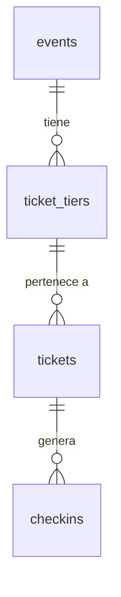
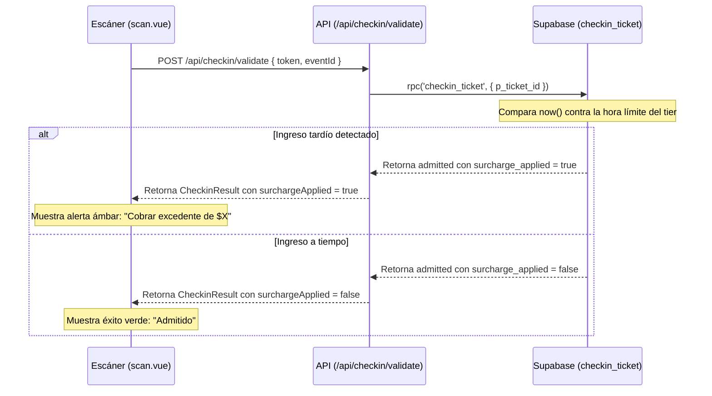

# Documento de Diseño

## Resumen
Esta especificación detalla el diseño técnico para restringir y asegurar la boletería por enlace público y calcular los recargos (excedentes) por ingreso tardío durante el check-in.

---

## Compromisos de Límite

### Ámbito del Diseño
- **Componentes Propios**:
  - Migración de base de datos para modificar `ticket_tiers` y `checkins`.
  - Actualización de la función SQL `checkin_ticket` para calcular recargos basados en la zona horaria de Colombia (UTC-5).
  - Actualización de tipos TypeScript en el frontend y en el backend.
  - Validación del formato de límite de ingreso en el servidor (`events-validation.ts`).
  - Interfaz de preselección y bloqueo en el formulario de registro público (`RegistrationForm.vue`).
  - Panel de administración para configurar recargos e ingreso límite en `tickets.vue` y `TicketTierForm.vue`.
  - Interfaz del escáner en `scan.vue` para advertir sobre excedentes y reportar en el historial de escaneo.
- **Dependencias Permitidas**:
  - Base de datos relacional PostgreSQL / Supabase.
  - Enrutamiento y estado de Nuxt 4.
  - Biblioteca `pdf-lib` para renderizar el ticket PDF.

### Disparadores de Revalidación
- Cambios en el contrato de retorno de la función `checkin_ticket`.
- Modificación de la estructura física de la tabla `checkins` o `ticket_tiers`.

---

## Arquitectura de Datos

### Modelo Físico de Datos



#### Cambios en Tablas

##### Tabla `public.ticket_tiers`
- `entry_time_limit` `time without time zone` (NULL) — Límite de tiempo diario para ingresar.
- `surcharge_amount` `numeric(12, 2)` (NOT NULL, DEFAULT 0.00) — Monto a cobrar si se supera la hora límite.

##### Tabla `public.checkins`
- `surcharge_applied` `boolean` (NOT NULL, DEFAULT false) — Indica si se aplicó un excedente.
- `surcharge_paid` `numeric(12, 2)` (NOT NULL, DEFAULT 0.00) — Monto recaudado por concepto de recargo.

---

## Componentes e Interfaces

### 1. Base de Datos (Función de Check-in)

#### `public.checkin_ticket(p_ticket_id uuid)`
- **Firma de Retorno**:
  ```sql
  returns table (
    result text,
    used_at timestamptz,
    full_name text,
    tier_name text,
    surcharge_applied boolean,
    surcharge_amount numeric
  )
  ```
- **Lógica de Comparación Temporal**:
  - Se calcula el límite absoluto convirtiendo `event_at` a la zona local `America/Bogota`.
  - Se construye el límite diario sumando `entry_time_limit` a la fecha del evento.
  - Si `entry_time_limit` es menor que la hora de inicio del evento, se suma 1 día al límite calculado (control de cruce de medianoche).
  - Se compara `now()` con el límite calculado. Si se supera, se marca `v_surcharge_applied := true`.

---

### 2. Frontend de Registro (`app/pages/e/[eventId]/register.vue` y `RegistrationForm.vue`)

- **Contrato de Props (`RegistrationForm.vue`)**:
  ```typescript
  interface Props {
    event: PublicEvent
    loading?: boolean
    defaultTierId?: string
  }
  ```
- **Lógica de Filtrado**:
  - Si `defaultTierId` está presente en la URL y pertenece al evento, el computed `filteredTiers` retorna únicamente esa categoría.
  - El selector `<select>` se deshabilita (`disabled`), bloqueando la interacción del cliente.

---

### 3. Panel de Administración y Escáner (`app/pages/scan.vue` y `tickets.vue`)

- **Contrato de API (`CheckinResult`)**:
  ```typescript
  export type CheckinResult =
    | { 
        status: 'admitted'
        attendee: { fullName: string; tierName: string }
        checkedInAt: string
        surchargeApplied?: boolean
        surchargeAmount?: number
      }
    | { status: 'already_used'; usedAt: string }
    | { status: 'invalid'; reason: string }
  ```
- **Visualización de Alertas (`scan.vue`)**:
  - Si `surchargeApplied` es `true`, el componente muestra una sección de alerta con fondo ámbar (`bg-amber-500` / `text-slate-900`) y bordes estilizados indicando la obligatoriedad del cobro.
- **Configuración de Categoría (`TicketTierForm.vue`)**:
  - Se añaden los campos de tipo `time` para `entryTimeLimit` y `number` para `surchargeAmount`.

---

## Flujos del Sistema

### Flujo de Check-in con Recargo



---

## Estrategia de Pruebas

### Pruebas Unitarias / Integración (Vitest)
- Validar que `validateTierInput` acepte formatos `HH:MM` y rechace formatos incorrectos.
- Validar el mapeo de campos de base de datos a modelos TypeScript en `events-repo.ts`.

### Pruebas de Sistema (SQL/Manual)
- Ejecutar check-ins de prueba simulando ingresos antes y después del límite de tiempo.
- Confirmar el cálculo correcto del cruce de medianoche en la base de datos.
- Probar el comportamiento del formulario público al inyectar parámetros manuales en la URL del navegador.
