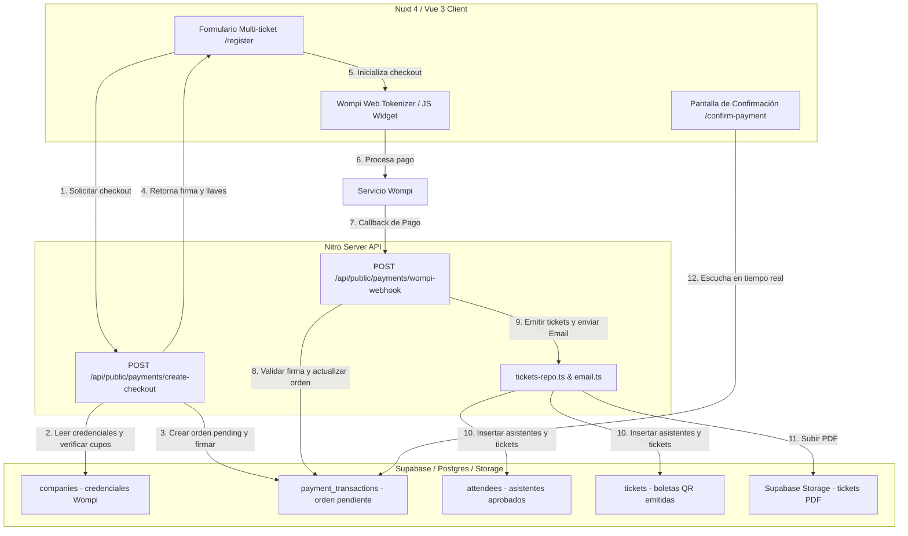
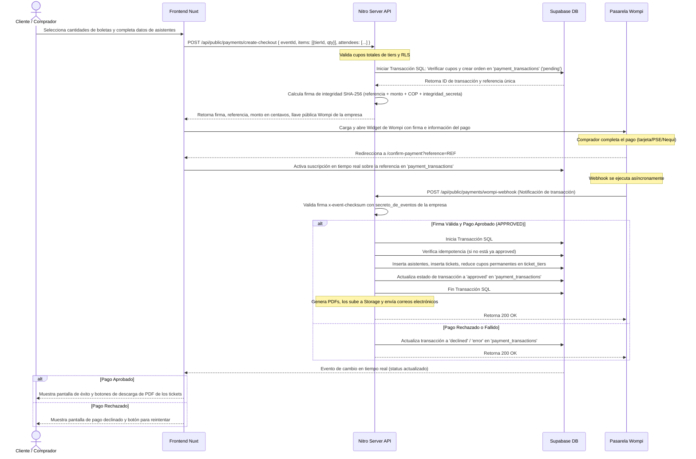

# Documento de Diseño: wompi-integration

## Resumen
Este documento detalla el diseño técnico para la integración multi-tenant de la pasarela de pagos Wompi (Colombia) en la plataforma de boletería. Permite a los organizadores de eventos (empresas) recaudar dinero de forma automatizada. Introduce un flujo de compra consolidado (carrito multi-ticket), generación de firmas de integridad en el backend, procesamiento asíncrono e idempotente de webhooks, y sincronización en tiempo real del frontend para la entrega automática del ticket PDF y su envío por correo electrónico tras la aprobación de la transacción.

### Objetivos
- Permitir la activación de Wompi de forma independiente por empresa, almacenando sus llaves y secretos de comercio.
- Reemplazar el flujo secuencial de registro individual por un formulario de compra consolidado (multi-ticket y multi-tier) si el evento tiene Wompi activo.
- Garantizar la seguridad del cobro mediante la generación de firmas de integridad server-side.
- Procesar el resultado de la transacción mediante un webhook en Nitro API que valide la firma de Wompi de forma criptográfica.
- Garantizar la idempotencia en el procesamiento de eventos del webhook para prevenir la emisión duplicada de boletas ante reintentos de la pasarela.
- Actualizar el frontend del usuario en tiempo real para que descargue sus boletas de inmediato una vez confirmado el pago.

### No Objetivos
- Gestión de reembolsos o cancelaciones de dinero desde el panel de Vita Felix.
- Conciliación contable automatizada con plataformas bancarias de terceros.

---

## Compromisos de Límites

### Este Spec Provee
- La configuración del modelo de datos para Wompi en empresas.
- El modelo y ciclo de vida de las transacciones de pago pendientes (`payment_transactions`).
- El endpoint `/api/public/payments/create-checkout` para validar aforo global, guardar la orden temporal y generar la firma de integridad de Wompi.
- El endpoint de Webhook `/api/public/payments/wompi-webhook` que autentica la petición de Wompi y emite de forma atómica los tickets aprobados.
- La interfaz de administración para activar y configurar las credenciales de Wompi de la empresa.
- El rediseño del formulario público de registro de asistentes para compras por lote.
- La vista de confirmación del estado del pago con Supabase Realtime en `/e/[eventId]/confirm-payment`.

### Fuera de Límites
- Integración física con lectores de tarjetas o datafonos en la taquilla de la puerta del evento (gestionado por el módulo `door-sales-and-cash-control`).

### Dependencias Permitidas
- `platform-foundation` para RLS y roles administrativos de empresas.
- `event-management` para la lectura y decremento de cupos en `ticket_tiers`.
- `ticket-actions-and-emails` para el envío de correos automatizados con los tickets generados.

### Disparadores de Revalidación
- Cambios en la API de transacciones o el formato de firmas de Wompi Colombia.
- Modificaciones en la estructura RLS que alteren el acceso a la tabla de empresas o eventos por parte de la cuenta del servidor (`service_role`).

---

## Arquitectura

### Mapa de Componentes y Flujo de Datos



### Stack Tecnológico

| Capa | Selección | Rol en el Componente |
| :--- | :--- | :--- |
| Frontend | Nuxt 4 (Vue 3) | Interfaz de compra unificada, carga del script del widget de Wompi, y visualización de confirmación de pago con Supabase Realtime. |
| Backend | Nuxt Server (h3) | Generación de firmas criptográficas SHA-256, autenticación y procesamiento del webhook de Wompi. |
| Data | Supabase (PostgreSQL) | Almacenamiento seguro de credenciales de comercio, control de transacciones de pago, y persistencia de asistentes y boletas. |
| Storage | Supabase Storage | Almacenamiento de archivos PDF de boletas y códigos QR generados. |

---

## Plan de Estructura de Archivos

### Archivos Nuevos y Modificados

```
app/
├── pages/
│   └── e/
│       └── [eventId]/
│           ├── register.vue                # [MODIFICADO] Lógica de selección múltiple e inicio de checkout
│           └── confirm-payment.vue         # [NUEVO] Pantalla de espera/éxito con suscripción en tiempo real
│   └── admin/
│       └── soporte/
│           └── pagos.vue                   # [NUEVO] Panel administrativo para auditar y forzar la emisión manual
├── components/
│   └── admin/
│       └── CompanyWompiConfig.vue          # [NUEVO] Componente de administración de llaves Wompi
server/
├── api/
│   ├── public/
│   │   └── payments/
│   │       ├── create-checkout.post.ts    # [NUEVO] Creación de orden temporal y cálculo de firma de integridad
│   │       └── wompi-webhook.post.ts      # [NUEVO] Webhook asíncrono de Wompi (emisión de tickets aprobados)
│   └── admin/
│       └── companies/
│           └── [id]/
│               └── wompi.put.ts            # [NUEVO] Endpoint para actualizar llaves de Wompi de la empresa
│       └── payments/
│           ├── transactions.get.ts         # [NUEVO] Listado de transacciones de pago online (Super Admin / Admin)
│           └── force-issue.post.ts         # [NUEVO] Aprobación manual y emisión de boletas para transacciones pendientes
```

---

## Flujos del Sistema

### Secuencia: Proceso de Compra e Integración con Wompi



---

## Modelo de Datos (SQL Migrations)

Se implementarán los siguientes cambios en Supabase a través de una nueva migración SQL:

```sql
-- 1) Agregar columnas de configuración de Wompi a la tabla de empresas
ALTER TABLE public.companies
  ADD COLUMN IF NOT EXISTS wompi_enabled BOOLEAN NOT NULL DEFAULT false,
  ADD COLUMN IF NOT EXISTS wompi_public_key TEXT,
  ADD COLUMN IF NOT EXISTS wompi_integrity_secret TEXT,
  ADD COLUMN IF NOT EXISTS wompi_events_secret TEXT;

-- Restricción para garantizar que si Wompi está activo, las llaves esenciales no estén vacías
ALTER TABLE public.companies
  ADD CONSTRAINT check_wompi_credentials 
  CHECK (
    (wompi_enabled = false) OR 
    (wompi_enabled = true AND wompi_public_key IS NOT NULL AND wompi_integrity_secret IS NOT NULL AND wompi_events_secret IS NOT NULL)
  );

-- 2) Crear tabla de transacciones de pago online
CREATE TABLE public.payment_transactions (
  id              uuid PRIMARY KEY DEFAULT gen_random_uuid(),
  company_id      uuid NOT NULL REFERENCES public.companies(id) ON DELETE CASCADE,
  event_id        uuid NOT NULL REFERENCES public.events(id) ON DELETE CASCADE,
  reference       text NOT NULL UNIQUE,          -- Referencia única generada para el comercio
  wompi_id        text,                           -- ID interno de la transacción de Wompi
  amount_in_cents bigint NOT NULL CHECK (amount_in_cents > 0),
  currency        char(3) NOT NULL DEFAULT 'COP',
  status          text NOT NULL DEFAULT 'pending' CHECK (status IN ('pending', 'approved', 'declined', 'voided', 'error')),
  
  -- Datos estructurados de los asistentes y los tiers seleccionados para su emisión posterior
  -- Formato: [{ tierId: "uuid", fullName: "Nombre", email: "correo@mail.com", cedula: "12345" }]
  attendees_data  jsonb NOT NULL,
  
  -- Trazabilidad de soporte para emisión manual
  audited_by      uuid REFERENCES auth.users(id) ON DELETE SET NULL,
  audited_at      timestamptz,
  audit_note      text,
  
  created_at      timestamptz NOT NULL DEFAULT now(),
  updated_at      timestamptz NOT NULL DEFAULT now()
);

-- Índices de consulta rápida
CREATE INDEX payment_transactions_reference_idx ON public.payment_transactions(reference);
CREATE INDEX payment_transactions_company_event_idx ON public.payment_transactions(company_id, event_id);

-- 3) Habilitar RLS en la tabla de transacciones
ALTER TABLE public.payment_transactions ENABLE ROW LEVEL SECURITY;
ALTER TABLE public.payment_transactions FORCE ROW LEVEL SECURITY;

-- Políticas de RLS
-- Permitir lectura anónima sobre la referencia de pago (para la pantalla pública de confirmación)
CREATE POLICY payment_transactions_select_public ON public.payment_transactions
  FOR SELECT TO anon, authenticated
  USING (true); -- La visualización se limita de forma segura filtrando por referencia en el cliente

-- Permitir modificaciones y visualización completa a roles administrativos de la empresa o Super Admin
CREATE POLICY payment_transactions_admin ON public.payment_transactions
  FOR ALL TO authenticated
  USING (
    (select public.is_super_admin())
    OR company_id = (select public.auth_company_id())
  );
```

---

## Contratos e Interfaces de Código

### Backend: Endpoint de Checkout (`create-checkout.post.ts`)
- **Contrato de Petición**:
  ```typescript
  export interface CreateCheckoutInput {
    eventId: string;
    items: Array<{
      tierId: string;
      quantity: number;
    }>;
    attendees: Array<{
      tierId: string;
      fullName: string;
      email: string;
      cedula: string;
    }>;
  }
  ```
- **Contrato de Respuesta**:
  ```typescript
  export interface CreateCheckoutResult {
    reference: string;
    amountInCents: number;
    currency: string;
    wompiPublicKey: string;
    signature: string;
    redirectUrl: string;
  }
  ```

---

### Backend: Endpoint de Soporte - Listado de Transacciones (`transactions.get.ts`)
- **Contrato de Petición (Query Parameters)**:
  ```typescript
  export interface GetTransactionsQuery {
    eventId?: string;     // Opcional: filtrar por evento
    status?: string;      // Opcional: filtrar por estado (pending, approved, etc.)
    search?: string;      // Opcional: buscar por referencia, nombre, email o cédula
    limit?: number;
    offset?: number;
  }
  ```
- **Contrato de Respuesta**:
  ```typescript
  export interface TransactionItem {
    id: string;
    eventId: string;
    eventName: string;
    companyId: string;
    companyName: string;
    reference: string;
    wompiId: string | null;
    amountInCents: number;
    currency: string;
    status: 'pending' | 'approved' | 'declined' | 'voided' | 'error';
    attendeesData: Array<{
      tierId: string;
      fullName: string;
      email: string;
      cedula: string;
    }>;
    auditedBy: string | null;
    auditedAt: string | null;
    auditNote: string | null;
    createdAt: string;
  }
  export type GetTransactionsResult = TransactionItem[];
  ```

### Backend: Endpoint de Soporte - Emisión Manual (`force-issue.post.ts`)
- **Contrato de Petición**:
  ```typescript
  export interface ForceIssueInput {
    transactionId: string;
    auditNote: string; // Explicación de soporte del porqué se fuerza (ej. "Pago verificado en Wompi de forma manual")
  }
  ```
- **Contrato de Respuesta**:
  ```typescript
  export interface ForceIssueResult {
    success: boolean;
    emittedTickets: string[]; // Listado de IDs de tickets creados
  }
  ```

---

## Control y Manejo de Errores

- **Cupo Insuficiente (`422 Unprocessable Entity`)**: Si al momento de solicitar el checkout de pago ya no hay aforo suficiente para la suma de las entradas solicitadas de un tier, el sistema devuelve `INSUFFICIENT_QUOTA`.
- **Firma de Webhook Inválida (`401 Unauthorized`)**: Si el checksum de la notificación de Wompi no coincide con la firma calculada en el servidor usando el `wompi_events_secret` de la empresa organizadora, se retorna `INVALID_WEBHOOK_SIGNATURE`.
- **Acceso No Autorizado en Soporte (`403 Forbidden`)**: Si un usuario con rol de empresa intenta listar o forzar la emisión sobre una transacción que no pertenece a su `company_id` (o si no tiene el rol de `SUPER_ADMIN` o `COMPANY_ADMIN`), se bloquea el acceso.
- **Transacción ya Aprobada (`409 Conflict`)**: Si se intenta forzar la emisión sobre una transacción que ya está en estado `'approved'`, el servidor retorna un error `TRANSACTION_ALREADY_APPROVED` para evitar duplicación.
- **Deduplicación por Cédula (`409 Conflict`)**: Al procesar la orden aprobada en el webhook o en soporte manual, si se detecta que alguna de las cédulas ingresadas ya está registrada para ese evento, el sistema emitirá el ticket del resto de asistentes pero registrará un error o advertencia en la auditoría para conciliación manual de esa cédula duplicada, o anulará la transacción SQL en su totalidad según política del organizador. Para evitar bloqueos, se recomienda verificar previamente la cédula en el frontend, y si ocurre concurrentemente, reportarlo al webhook para emitir las boletas aprobadas bajo un prefijo especial para no perder el dinero del comprador.
